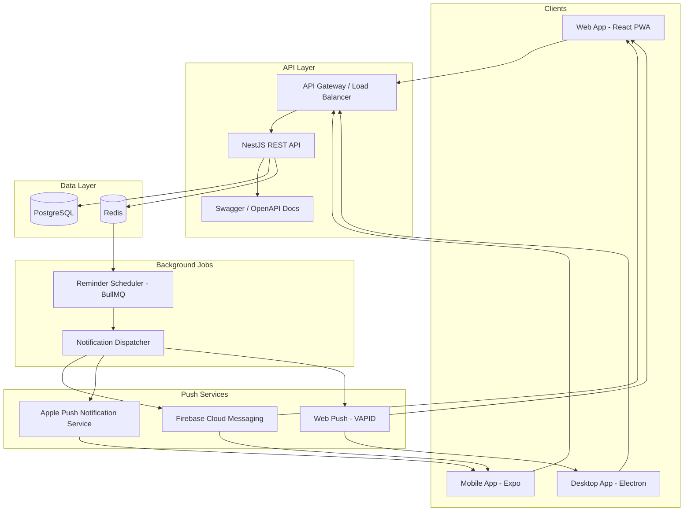
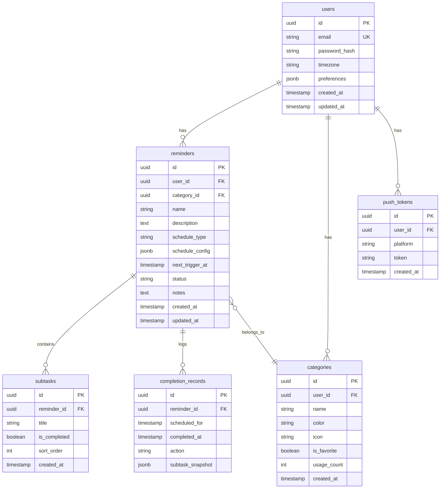

# RemindMe — Architecture & Repo Layout

> API-driven, TypeScript monorepo, single language across all platforms.

---

## Language Decision: TypeScript Everywhere

**Yes, one language can facilitate everything.** TypeScript covers:

| Layer | Runtime | Framework |
|-------|---------|-----------|
| API Backend | Node.js 20+ | NestJS (structured, opinionated, great for APIs) |
| Web Frontend | Browser | React 18 + Vite |
| Mobile (iOS + Android) | Hermes | React Native + Expo SDK 52+ |
| Desktop (macOS, Windows, Linux) | Electron 30+ | React (shared with web) |
| Shared Logic | Any | Pure TypeScript package |
| Job Scheduler | Node.js | BullMQ + Redis |
| Database Migrations | Node.js | Prisma ORM |

**Why TypeScript?**
- One language to hire for, one ecosystem to maintain
- Shared types between API and all clients (no drift)
- Shared validation logic (Zod schemas used everywhere)
- Massive ecosystem, battle-tested for all target platforms
- Expo simplifies mobile; Electron simplifies desktop

---

## Monorepo Structure

**Yes, one repo.** All platforms share types, validation, and API contracts. A monorepo with Turborepo keeps builds fast and dependencies synced.

```
remindme/
├── .github/
│   ├── workflows/
│   │   ├── ci.yml                    # Lint, test, build on every PR
│   │   ├── release-api.yml           # API: build, tag, deploy
│   │   ├── release-web.yml           # Web: build, deploy to CDN
│   │   ├── release-mobile.yml        # Mobile: EAS Build + Submit
│   │   ├── release-desktop.yml       # Desktop: Electron Builder
│   │   └── canary.yml                # Canary deployments
│   ├── CODEOWNERS
│   └── pull_request_template.md
│
├── packages/
│   ├── api/                          # NestJS REST API
│   │   ├── src/
│   │   │   ├── modules/
│   │   │   │   ├── auth/             # Authentication (JWT + refresh tokens)
│   │   │   │   ├── reminders/        # CRUD + scheduling logic
│   │   │   │   ├── categories/       # Category management
│   │   │   │   ├── subtasks/         # Subtask CRUD
│   │   │   │   ├── notifications/    # Push notification dispatch
│   │   │   │   └── sync/             # Export/import/sync endpoints
│   │   │   ├── jobs/                 # BullMQ job processors
│   │   │   │   ├── reminder-scheduler.job.ts
│   │   │   │   └── notification-dispatcher.job.ts
│   │   │   ├── common/               # Guards, interceptors, filters
│   │   │   └── main.ts
│   │   ├── prisma/
│   │   │   ├── schema.prisma
│   │   │   └── migrations/
│   │   ├── test/
│   │   ├── Dockerfile
│   │   └── package.json
│   │
│   ├── web/                          # React + Vite PWA
│   │   ├── src/
│   │   │   ├── components/           # Shared UI components
│   │   │   ├── pages/                # Route-level components
│   │   │   ├── hooks/                # Custom React hooks
│   │   │   ├── services/             # API client, push registration
│   │   │   ├── store/                # Zustand state management
│   │   │   └── sw.ts                 # Service worker for push + offline
│   │   ├── public/
│   │   │   ├── manifest.json         # PWA manifest
│   │   │   └── icons/
│   │   └── package.json
│   │
│   ├── mobile/                       # React Native + Expo
│   │   ├── app/                      # Expo Router (file-based routing)
│   │   │   ├── (tabs)/
│   │   │   │   ├── index.tsx         # Home
│   │   │   │   ├── all.tsx           # All reminders
│   │   │   │   ├── categories.tsx    # Categories
│   │   │   │   └── settings.tsx      # Settings
│   │   │   ├── reminder/
│   │   │   │   ├── [id].tsx          # Reminder detail
│   │   │   │   └── new.tsx           # New reminder
│   │   │   └── _layout.tsx
│   │   ├── components/               # Mobile-specific components
│   │   ├── services/                 # API client, push setup
│   │   ├── app.json                  # Expo config
│   │   ├── eas.json                  # EAS Build config
│   │   └── package.json
│   │
│   ├── desktop/                      # Electron wrapper
│   │   ├── src/
│   │   │   ├── main.ts              # Electron main process
│   │   │   ├── preload.ts           # Preload script (IPC bridge)
│   │   │   └── notifications.ts     # Native notification integration
│   │   ├── electron-builder.yml     # Build config for all desktop OS
│   │   └── package.json
│   │
│   └── shared/                       # Shared TypeScript package
│       ├── src/
│       │   ├── types/                # API types, DTOs
│       │   │   ├── reminder.ts
│       │   │   ├── category.ts
│       │   │   ├── subtask.ts
│       │   │   └── user.ts
│       │   ├── schemas/              # Zod validation schemas
│       │   │   ├── reminder.schema.ts
│       │   │   ├── category.schema.ts
│       │   │   └── auth.schema.ts
│       │   ├── constants/            # Shared constants
│       │   ├── utils/                # Date helpers, formatters
│       │   └── index.ts
│       └── package.json
│
├── infrastructure/
│   ├── docker/
│   │   ├── docker-compose.yml        # Local dev: API + Postgres + Redis
│   │   ├── docker-compose.prod.yml   # Production stack
│   │   └── Dockerfile.api
│   ├── terraform/                    # Infrastructure as Code (optional)
│   └── k8s/                          # Kubernetes manifests (if needed)
│       ├── api-deployment.yml
│       ├── api-service.yml
│       ├── redis-deployment.yml
│       └── ingress.yml
│
├── docs/                             # You are here
│   ├── PRODUCT_SPEC.md
│   ├── DESIGN_SPEC.md
│   ├── ARCHITECTURE.md
│   ├── API.md                        # API documentation (auto-generated from Swagger)
│   └── DEPLOYMENT.md
│
├── scripts/
│   ├── setup.sh                      # One-liner dev setup
│   ├── seed.ts                       # Seed database with test data
│   └── test-notifications.ts         # Test push notification delivery
│
├── turbo.json                        # Turborepo pipeline config
├── package.json                      # Root workspace config
├── tsconfig.base.json                # Shared TypeScript config
├── .eslintrc.js                      # Shared lint config
├── .prettierrc                       # Code formatting
├── .env.example                      # Environment variable template
└── README.md                         # Project overview + quick start
```

---

## System Architecture



---

## API Endpoints (REST)

### Auth
| Method | Endpoint | Description |
|--------|----------|-------------|
| POST | `/api/v1/auth/register` | Create account |
| POST | `/api/v1/auth/login` | Login → JWT + refresh token |
| POST | `/api/v1/auth/refresh` | Refresh JWT |
| POST | `/api/v1/auth/logout` | Invalidate refresh token |

### Reminders
| Method | Endpoint | Description |
|--------|----------|-------------|
| GET | `/api/v1/reminders` | List all reminders (paginated, filterable) |
| GET | `/api/v1/reminders/:id` | Get reminder detail |
| POST | `/api/v1/reminders` | Create reminder |
| PATCH | `/api/v1/reminders/:id` | Update reminder |
| DELETE | `/api/v1/reminders/:id` | Delete reminder |
| POST | `/api/v1/reminders/:id/complete` | Complete current occurrence |
| POST | `/api/v1/reminders/:id/snooze` | Snooze by N minutes |
| POST | `/api/v1/reminders/:id/skip` | Skip current occurrence |

### Subtasks
| Method | Endpoint | Description |
|--------|----------|-------------|
| GET | `/api/v1/reminders/:id/subtasks` | List subtasks |
| POST | `/api/v1/reminders/:id/subtasks` | Create subtask |
| PATCH | `/api/v1/subtasks/:id` | Update subtask (toggle, rename, reorder) |
| DELETE | `/api/v1/subtasks/:id` | Delete subtask |

### Categories
| Method | Endpoint | Description |
|--------|----------|-------------|
| GET | `/api/v1/categories` | List user's categories |
| POST | `/api/v1/categories` | Create category |
| PATCH | `/api/v1/categories/:id` | Update category |
| DELETE | `/api/v1/categories/:id` | Delete category |
| POST | `/api/v1/categories/:id/favorite` | Toggle favorite |

### Sync / Export
| Method | Endpoint | Description |
|--------|----------|-------------|
| GET | `/api/v1/sync/export` | Export all data as JSON |
| POST | `/api/v1/sync/import` | Import data from JSON |

### Notifications
| Method | Endpoint | Description |
|--------|----------|-------------|
| POST | `/api/v1/notifications/register` | Register device push token |
| DELETE | `/api/v1/notifications/unregister` | Remove push token |
| POST | `/api/v1/notifications/test` | Send test notification |

---

## Database Schema (PostgreSQL)



---

## Tech Stack Details

### Backend
| Tool | Purpose | Why |
|------|---------|-----|
| NestJS | API framework | Structured, modular, built-in validation, Swagger gen |
| Prisma | ORM | Type-safe queries, auto-migration, great DX |
| PostgreSQL 16 | Database | Reliable, JSON support, great for scheduling queries |
| Redis 7 | Queue + cache | BullMQ for job scheduling, caching for hot data |
| BullMQ | Job queue | Reliable delayed/repeatable jobs for reminder scheduling |
| Passport.js | Auth | JWT strategy, extensible |
| Zod | Validation | Shared with frontend via `@remindme/shared` |

### Frontend (Web)
| Tool | Purpose |
|------|---------|
| React 18 | UI framework |
| Vite 5 | Build tool |
| React Router 6 | Routing |
| Zustand | State management (lightweight) |
| TanStack Query | API data fetching + caching |
| Tailwind CSS 3 | Styling |
| Workbox | Service worker / PWA |

### Mobile
| Tool | Purpose |
|------|---------|
| Expo SDK 52+ | React Native framework |
| Expo Router | File-based navigation |
| Expo Notifications | Push notification handling |
| React Native Paper / Tamagui | UI components |

### Desktop
| Tool | Purpose |
|------|---------|
| Electron 30+ | Desktop shell |
| electron-builder | Cross-platform packaging |
| electron-updater | Auto-updates |
