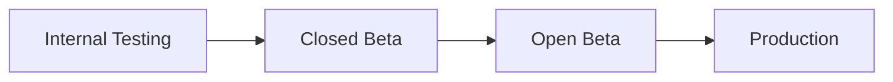
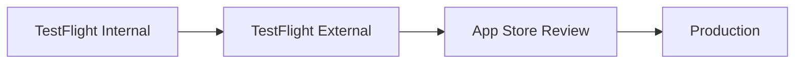
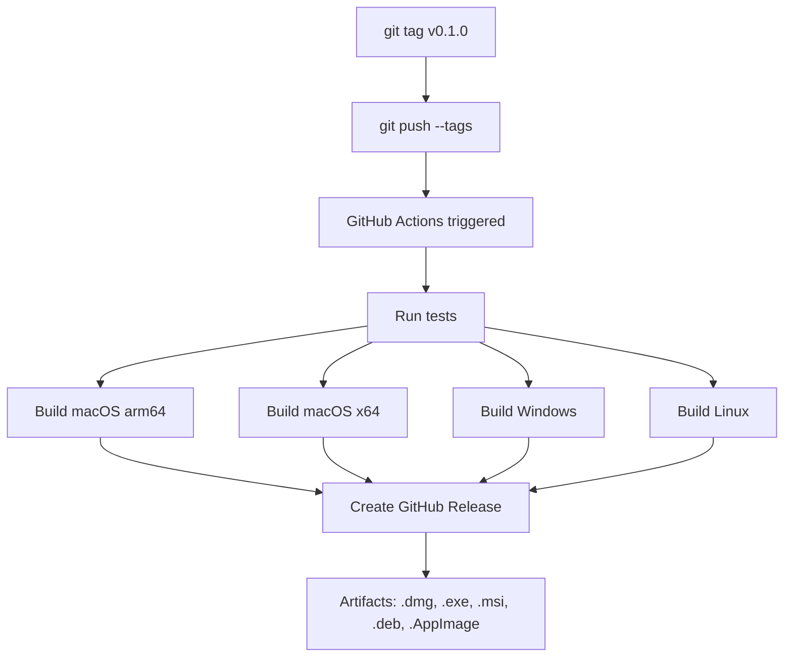

# Oh Right! — Build and Distribution Guide

> Practical steps for building, signing, and distributing Oh Right! across macOS, Windows, Linux, Android, and iOS.

---

## Table of Contents

1. [Development Setup](#1-development-setup)
2. [Desktop Builds (Tauri v2)](#2-desktop-builds-tauri-v2)
3. [Mobile Builds (Expo / EAS)](#3-mobile-builds-expo--eas)
4. [CI/CD Release Process](#4-cicd-release-process)
5. [Environment Variables for CI](#5-environment-variables-for-ci)
6. [Version Bumping](#6-version-bumping)

---

## 1. Development Setup

### Prerequisites

| Tool | Version | Purpose |
|------|---------|---------|
| Node.js | 20+ | JS runtime (enforced in root `package.json` `engines`) |
| npm | 10+ | Package manager (ships with Node 20) |
| Rust | stable | Tauri backend compilation |
| Xcode CLI tools | latest | macOS builds (`xcode-select --install`) |
| Android Studio | latest | Mobile Android builds (SDK, emulator) |
| Turbo | 2+ | Monorepo task runner (installed as devDep) |

### Install and Run

```bash
# 1. Clone and install
git clone https://github.com/h3nryza/todo_app.git
cd todo_app
npm install

# 2. Build the shared package first (other packages depend on it)
npx tsc -p packages/shared/tsconfig.json

# 3. Run the UI dev server (Vite on port 1420)
npm run dev

# 4. Run the full desktop app (Tauri + UI)
npm run dev:desktop
```

### Project Structure

```
packages/
  shared/     # @ohright/shared — models, utils, logic
  ui/         # @ohright/ui — React frontend (Vite)
  desktop/    # @ohright/desktop — Tauri v2 shell
```

---

## 2. Desktop Builds (Tauri v2)

All desktop builds use the same core command. The output varies by platform.

```bash
# From project root
npm run build:desktop

# Or directly
cd packages/desktop && npx tauri build
```

> The `tauri.conf.json` lives at `packages/desktop/src-tauri/tauri.conf.json`.
> Bundle targets are set to `"all"`, so each platform produces every format it supports.

---

### macOS

#### Build Output

| Format | Location |
|--------|----------|
| `.app` | `packages/desktop/src-tauri/target/release/bundle/macos/` |
| `.dmg` | `packages/desktop/src-tauri/target/release/bundle/dmg/` |

For cross-architecture builds (CI produces both):

```bash
# Apple Silicon
npx tauri build --target aarch64-apple-darwin

# Intel
npx tauri build --target x86_64-apple-darwin
```

#### Code Signing

Unsigned macOS apps trigger Gatekeeper warnings ("app is damaged" / "unidentified developer"). For public distribution, you need to sign and notarize.

**Requirements:**
- Apple Developer account ($99/year) at [developer.apple.com](https://developer.apple.com)
- A "Developer ID Application" certificate exported as `.p12`

**Environment variables for signing:**

```bash
export APPLE_SIGNING_IDENTITY="Developer ID Application: Your Name (TEAM_ID)"
export APPLE_CERTIFICATE="base64-encoded-.p12-certificate"
export APPLE_CERTIFICATE_PASSWORD="certificate-password"
```

**Environment variables for notarization:**

```bash
export APPLE_ID="your@apple.id"
export APPLE_PASSWORD="app-specific-password"
export APPLE_TEAM_ID="XXXXXXXXXX"
```

Generate an app-specific password at [appleid.apple.com](https://appleid.apple.com) under Sign-In and Security > App-Specific Passwords.

In CI, the `tauri-apps/tauri-action` picks up these env vars automatically. See [Section 4](#4-cicd-release-process).

#### Distribution Options

| Channel | Notes |
|---------|-------|
| **GitHub Releases** | Automated via `release-desktop.yml`. Users download `.dmg` directly. |
| **Direct download** | Host the `.dmg` on your website. Must be signed + notarized. |
| **Mac App Store** | Requires separate "Apple Distribution" certificate and sandbox entitlements. Significantly more work — defer until user base justifies it. |

---

### Windows

#### Build Output

| Format | Location |
|--------|----------|
| `.exe` (NSIS installer) | `packages/desktop/src-tauri/target/release/bundle/nsis/` |
| `.msi` | `packages/desktop/src-tauri/target/release/bundle/msi/` |

Build must run on a Windows machine or CI runner (`windows-latest`).

#### Code Signing

Unsigned Windows apps trigger SmartScreen warnings ("Windows protected your PC"). For public distribution, sign the `.exe` and `.msi`.

**Requirements:**
- A code signing certificate from a trusted CA:
  - DigiCert (~$200/year) — fastest SmartScreen reputation
  - Sectigo/Comodo (~$70-80/year) — budget option
  - SSL.com (~$70/year) — EV option available
- EV (Extended Validation) certificates remove SmartScreen warnings immediately; OV (Organization Validation) certificates build reputation over time.

**Environment variable:**

```bash
export TAURI_SIGNING_PRIVATE_KEY="base64-encoded-private-key"
```

In CI, set this as a GitHub Actions secret. The `tauri-apps/tauri-action` handles the rest.

#### Distribution Options

| Channel | Notes |
|---------|-------|
| **GitHub Releases** | Automated. Users download `.exe` or `.msi`. |
| **Direct download** | Host on your website. Must be signed to avoid SmartScreen. |
| **Microsoft Store** | Package as MSIX. Requires Microsoft Partner Center account (one-time ~$19 fee). |

---

### Linux

#### Build Output

| Format | Location |
|--------|----------|
| `.deb` | `packages/desktop/src-tauri/target/release/bundle/deb/` |
| `.AppImage` | `packages/desktop/src-tauri/target/release/bundle/appimage/` |

Build must run on a Linux machine or CI runner (`ubuntu-22.04`).

**System dependencies (installed automatically in CI):**

```bash
sudo apt-get install -y \
  libwebkit2gtk-4.1-dev \
  libappindicator3-dev \
  librsvg2-dev \
  patchelf \
  libssl-dev
```

#### Code Signing

Not required. Linux does not have a centralized gatekeeper like macOS or Windows. AppImage is self-contained and runs without installation.

#### Distribution Options

| Channel | Notes |
|---------|-------|
| **GitHub Releases** | Automated. Users download `.AppImage` or `.deb`. |
| **Flathub** | Requires a Flatpak manifest. Good for discoverability. |
| **Snapcraft** | Requires a `snapcraft.yaml`. Hosted on the Snap Store. |
| **AUR** | For Arch Linux users. Community can create a PKGBUILD. |

---

## 3. Mobile Builds (Expo / EAS)

Mobile builds use [Expo Application Services (EAS)](https://expo.dev/eas). Install the CLI globally:

```bash
npm install -g eas-cli
eas login
```

---

### Android

#### Development

```bash
# Start Expo dev server
npx expo start

# Run on connected device or emulator
npx expo run:android
```

#### Build APK (for testing / sideloading)

```bash
eas build -p android --profile preview
```

This produces a `.apk` you can install directly on any Android device.

#### Build AAB (for Google Play Store)

```bash
eas build -p android --profile production
```

This produces an `.aab` (Android App Bundle), which is the required format for Google Play.

#### Publishing to Google Play

1. **Create a Google Play Developer account** — one-time $25 fee at [play.google.com/console](https://play.google.com/console)
2. **Create the app listing** — fill in title, description, screenshots, content rating
3. **Upload the AAB** via the Play Console
4. **Release track progression:**



- **Internal testing**: Up to 100 testers, no review required, available within minutes
- **Closed beta**: Invite-only, light review
- **Open beta**: Public opt-in, full review
- **Production**: Available to all users on Google Play

---

### iOS

#### Development

```bash
# Start Expo dev server
npx expo start

# Run on simulator (requires Xcode)
npx expo run:ios
```

#### Build for App Store

```bash
eas build -p ios --profile production
```

EAS handles provisioning profiles and certificates automatically if you connect your Apple Developer account.

#### Publishing to the App Store

1. **Apple Developer account required** — $99/year at [developer.apple.com](https://developer.apple.com)
2. **Submit via EAS:**

```bash
eas submit -p ios
```

3. **Release track progression:**



- **TestFlight Internal**: Up to 25 team members, no review
- **TestFlight External**: Up to 10,000 testers, requires beta review
- **App Store Review**: Apple reviews the app (typically 24-48 hours)
- **Production**: Available on the App Store

---

## 4. CI/CD Release Process

Desktop builds are fully automated via the workflow at `.github/workflows/release-desktop.yml`.

### How It Works



### Trigger a Release

```bash
# 1. Make sure all changes are committed and pushed
git status

# 2. Tag the release
git tag v0.1.0

# 3. Push the tag — this triggers the workflow
git push --tags
```

The workflow:
1. Runs tests (type-check, unit tests) on `ubuntu-latest`
2. Builds in parallel on `macos-latest` (arm64 + x64), `windows-latest`, and `ubuntu-22.04`
3. Uploads artifacts from each job
4. Creates a GitHub Release with auto-generated release notes
5. Attaches all binaries (`.dmg`, `.exe`, `.msi`, `.deb`, `.AppImage`)

**Pre-release detection:** Tags containing a hyphen (e.g., `v0.1.0-beta.1`) are automatically marked as pre-releases.

### Mobile Releases (Manual for Now)

Mobile builds are triggered manually via EAS:

```bash
# Android
eas build -p android --profile production
eas submit -p android

# iOS
eas build -p ios --profile production
eas submit -p ios
```

To automate mobile releases, add an EAS Build workflow or use `eas build --auto-submit`.

---

## 5. Environment Variables for CI

Set these as **GitHub Actions secrets** in your repository settings (`Settings > Secrets and variables > Actions`).

### macOS Signing and Notarization

| Secret | Description |
|--------|-------------|
| `APPLE_CERTIFICATE` | Base64-encoded `.p12` certificate. Export from Keychain, then `base64 -i certificate.p12 \| pbcopy` |
| `APPLE_CERTIFICATE_PASSWORD` | Password used when exporting the `.p12` |
| `APPLE_SIGNING_IDENTITY` | Full name, e.g., `Developer ID Application: Your Name (TEAM_ID)` |
| `APPLE_ID` | Your Apple ID email |
| `APPLE_PASSWORD` | App-specific password (not your Apple ID password) |
| `APPLE_TEAM_ID` | 10-character Team ID from [developer.apple.com/account](https://developer.apple.com/account) |

### Windows Signing

| Secret | Description |
|--------|-------------|
| `TAURI_SIGNING_PRIVATE_KEY` | Base64-encoded code signing private key |

### Mobile (EAS)

| Secret | Description |
|--------|-------------|
| `EXPO_TOKEN` | Personal access token from [expo.dev/accounts/settings/access-tokens](https://expo.dev/accounts/settings/access-tokens) |

### Already Configured

| Secret | Description |
|--------|-------------|
| `GITHUB_TOKEN` | Automatically provided by GitHub Actions. Used by `tauri-apps/tauri-action` and `softprops/action-gh-release`. No setup needed. |

---

## 6. Version Bumping

The version number lives in multiple files that must stay in sync:

| File | Field | Current |
|------|-------|---------|
| `package.json` (root) | `version` | `0.0.1-alpha` |
| `packages/shared/package.json` | `version` | check file |
| `packages/ui/package.json` | `version` | check file |
| `packages/desktop/package.json` | `version` | check file |
| `packages/desktop/src-tauri/tauri.conf.json` | `version` | `0.0.1` |
| `app.json` (when mobile is added) | `expo.version` | TBD |

### Manual Bump

```bash
# 1. Update root package.json
npm version 0.1.0 --no-git-tag-version

# 2. Update each workspace
npm version 0.1.0 --no-git-tag-version -w packages/shared
npm version 0.1.0 --no-git-tag-version -w packages/ui
npm version 0.1.0 --no-git-tag-version -w packages/desktop

# 3. Update tauri.conf.json manually (or with sed)
# The version field must be a clean semver (no pre-release suffix for Tauri)

# 4. Commit and tag
git add -A
git commit -m "chore: bump version to 0.1.0"
git tag v0.1.0
git push && git push --tags
```

### Recommended: Version Script

Create a script at `scripts/bump-version.sh` to automate this:

```bash
#!/usr/bin/env bash
set -euo pipefail

VERSION="${1:?Usage: ./scripts/bump-version.sh <version>}"

# Strip leading 'v' if present
VERSION="${VERSION#v}"

echo "Bumping all packages to $VERSION..."

# Root
npm version "$VERSION" --no-git-tag-version

# Workspaces
for pkg in packages/shared packages/ui packages/desktop; do
  npm version "$VERSION" --no-git-tag-version -w "$pkg"
done

# Tauri config (clean semver, no pre-release suffix)
CLEAN_VERSION=$(echo "$VERSION" | sed 's/-.*//')
sed -i.bak "s/\"version\": \".*\"/\"version\": \"$CLEAN_VERSION\"/" \
  packages/desktop/src-tauri/tauri.conf.json
rm -f packages/desktop/src-tauri/tauri.conf.json.bak

echo "Done. Version is now $VERSION"
echo ""
echo "Next steps:"
echo "  git add -A"
echo "  git commit -m 'chore: bump version to $VERSION'"
echo "  git tag v$VERSION"
echo "  git push && git push --tags"
```

```bash
chmod +x scripts/bump-version.sh
./scripts/bump-version.sh 0.1.0
```

---

## Quick Reference: First Public Release Checklist

- [ ] Set up Apple Developer account ($99/year) for macOS signing + iOS
- [ ] Export Developer ID Application certificate as `.p12`
- [ ] Generate app-specific password for notarization
- [ ] Purchase Windows code signing certificate ($70-200/year)
- [ ] Create Google Play Developer account ($25 one-time)
- [ ] Add all secrets to GitHub Actions (see [Section 5](#5-environment-variables-for-ci))
- [ ] Run `./scripts/bump-version.sh 0.1.0`
- [ ] `git tag v0.1.0 && git push --tags`
- [ ] Verify GitHub Release is created with all platform binaries
- [ ] Submit mobile builds via EAS
