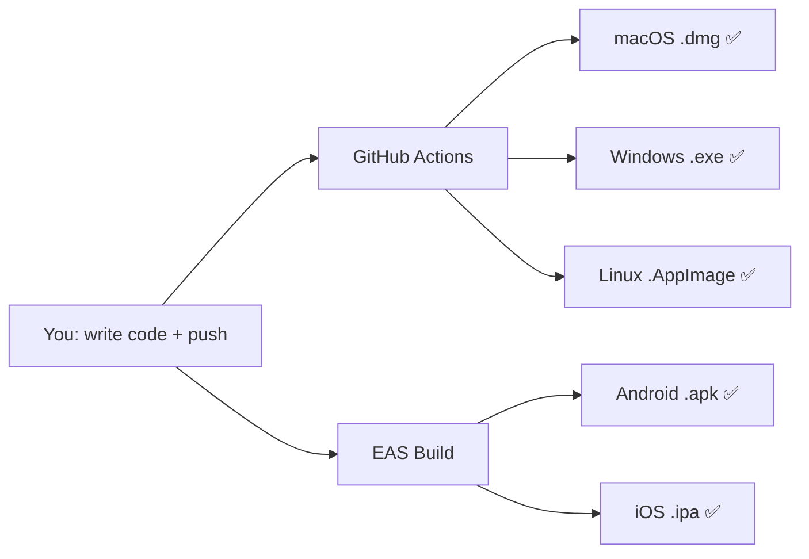

# Oh Right! — Current Build Process & Cloud Setup

> How to build locally, set up externalized cloud builds, and where every secret goes.

---

## Table of Contents

1. [Current Local Build Process](#1-current-local-build-process)
2. [Externalize Desktop Builds (GitHub Actions)](#2-externalize-desktop-builds-github-actions)
3. [Externalize Mobile Builds (EAS)](#3-externalize-mobile-builds-eas)
4. [Complete Secrets Reference](#4-complete-secrets-reference)
5. [Day-to-Day Workflow](#5-day-to-day-workflow)

---

## 1. Current Local Build Process

### What you do today (on your Mac)

```bash
# Step 1: Install dependencies (one-time, or after package changes)
npm install

# Step 2: Build the shared type library
npm run build -w @ohright/shared

# Step 3: Build the React UI
npm run build -w @ohright/ui

# Step 4: Build the Tauri desktop app (compiles Rust — takes ~30s first time, ~5s incremental)
npx tauri build

# Output:
#   packages/desktop/src-tauri/target/release/bundle/macos/Oh Right!.app
#   packages/desktop/src-tauri/target/release/bundle/dmg/Oh Right!_0.0.1_aarch64.dmg
```

### Run tests

```bash
npm run test -w @ohright/shared    # 102 tests
npm run test -w @ohright/ui        # 16 tests
```

### Run in dev mode (hot-reload)

```bash
# UI only (opens in browser at localhost:1420)
npm run dev

# Full desktop app (Tauri wraps the UI)
npx tauri dev
```

### What's slow locally

| Step | Time | Can externalize? |
|------|------|-----------------|
| `npm install` | 10-20s | No (needed locally) |
| Build shared | 1-2s | Yes (CI does it) |
| Build UI (Vite) | 1-2s | Yes (CI does it) |
| Build Tauri (Rust) | 25-90s | **Yes — GitHub Actions** |
| Build mobile (Expo) | N/A | **Yes — EAS Build** |
| Windows/Linux builds | Can't do locally | **Yes — GitHub Actions** |

---

## 2. Externalize Desktop Builds (GitHub Actions)

### Already configured

The workflow `.github/workflows/release-desktop.yml` builds for **all 4 platforms** when you push a version tag.

### How to use it

```bash
# 1. Make sure everything is committed and pushed
git push origin feat/local-first-native

# 2. Tag a release
git tag v0.1.0

# 3. Push the tag — this triggers the cloud build
git push --tags

# 4. Wait ~10-15 minutes. GitHub builds:
#    - macOS ARM (Apple Silicon) → .dmg
#    - macOS x64 (Intel) → .dmg
#    - Windows → .exe + .msi
#    - Linux → .deb + .AppImage

# 5. Download from: https://github.com/h3nryza/todo_app/releases
```

### GitHub Actions secrets for SIGNED builds

Go to: **GitHub repo → Settings → Secrets and variables → Actions → New repository secret**

```
┌─────────────────────────────────────────────────────────────────────┐
│  GITHUB ACTIONS SECRETS                                             │
│  (Settings > Secrets and variables > Actions > New repository secret)│
├─────────────────────────────────┬───────────────────────────────────┤
│  Secret Name                    │  What / How to Get It             │
├─────────────────────────────────┼───────────────────────────────────┤
│                                 │                                   │
│  --- macOS Signing ---          │                                   │
│                                 │                                   │
│  APPLE_CERTIFICATE              │  Base64-encoded .p12 certificate  │
│                                 │  How: Open Keychain Access →      │
│                                 │  export "Developer ID Application"│
│                                 │  cert as .p12 → run:              │
│                                 │  base64 -i cert.p12 | pbcopy     │
│                                 │  Paste the clipboard contents.    │
│                                 │                                   │
│  APPLE_CERTIFICATE_PASSWORD     │  The password you set when        │
│                                 │  exporting the .p12 file          │
│                                 │                                   │
│  APPLE_SIGNING_IDENTITY         │  Full certificate name, e.g.:    │
│                                 │  "Developer ID Application:       │
│                                 │   Henry (XXXXXXXXXX)"             │
│                                 │  Find it: Keychain Access →       │
│                                 │  My Certificates → copy the name  │
│                                 │                                   │
│  --- macOS Notarization ---     │                                   │
│                                 │                                   │
│  APPLE_ID                       │  Your Apple ID email              │
│                                 │  e.g.: henry@example.com          │
│                                 │                                   │
│  APPLE_PASSWORD                 │  App-specific password (NOT your  │
│                                 │  Apple ID password). Generate at: │
│                                 │  appleid.apple.com → Sign-In &    │
│                                 │  Security → App-Specific Passwords│
│                                 │                                   │
│  APPLE_TEAM_ID                  │  10-character Team ID. Find at:   │
│                                 │  developer.apple.com/account →    │
│                                 │  Membership Details               │
│                                 │                                   │
│  --- Windows Signing ---        │                                   │
│                                 │                                   │
│  TAURI_SIGNING_PRIVATE_KEY      │  Base64-encoded signing key.      │
│                                 │  From your code signing cert      │
│                                 │  provider (DigiCert, Sectigo).    │
│                                 │  Not needed until you distribute  │
│                                 │  publicly on Windows.             │
│                                 │                                   │
│  --- Mobile (EAS) ---           │                                   │
│                                 │                                   │
│  EXPO_TOKEN                     │  See Section 3 below              │
│                                 │                                   │
├─────────────────────────────────┼───────────────────────────────────┤
│  GITHUB_TOKEN                   │  Automatic — GitHub provides this │
│                                 │  No setup needed.                 │
└─────────────────────────────────┴───────────────────────────────────┘
```

> **You don't need ANY of these secrets for unsigned builds.** The CI will still build and upload unsigned binaries to GitHub Releases. Signing is only needed to avoid OS warnings when users install the app.

---

## 3. Externalize Mobile Builds (EAS)

### One-time setup (do this once)

```bash
# Step 1: Install EAS CLI globally
npm install -g eas-cli

# Step 2: Create a free Expo account
eas login
#   → Creates account at expo.dev if you don't have one
#   → Free tier: 30 builds/month

# Step 3: Link the project
cd packages/mobile
eas init
#   → This creates/links an Expo project ID
#   → Writes the project ID into app.json under "expo.extra.eas.projectId"

# Step 4: Verify it worked
eas whoami
#   → Should show your username

# Step 5: Generate a personal access token for CI (optional, for automated builds)
#   → Go to: https://expo.dev/accounts/[your-username]/settings/access-tokens
#   → Click "Create Token"
#   → Name: "github-actions"
#   → Copy the token
#   → Add to GitHub secrets as: EXPO_TOKEN
```

### Build Android APK (for testing)

```bash
cd packages/mobile

# Build in the cloud — produces an APK you can install on any Android phone
eas build -p android --profile preview

# EAS shows a URL when done:
#   https://expo.dev/artifacts/eas/xxxxx.apk
# Download it → transfer to phone → install
```

### Build Android AAB (for Google Play)

```bash
eas build -p android --profile production

# Produces an AAB file → upload to Google Play Console
# Google Play Developer account: $25 one-time at play.google.com/console
```

### Build iOS (for TestFlight / App Store)

```bash
# EAS handles provisioning profiles + signing automatically
# Just needs your Apple Developer account connected
eas build -p ios --profile production

# Submit directly to TestFlight:
eas submit -p ios

# Apple Developer account: $99/year at developer.apple.com
```

### Connect Apple Developer account to EAS

```bash
# EAS will prompt for your Apple ID on first iOS build
# Or pre-configure:
eas credentials -p ios
#   → Choose "Log in to your Apple Developer account"
#   → Enter Apple ID + password
#   → EAS manages certificates and profiles for you
```

### EAS config reference

The file `packages/mobile/eas.json` defines build profiles:

```
┌──────────────────────────────────────────────────────────────┐
│  Profile        │ What it builds        │ When to use        │
├─────────────────┼───────────────────────┼────────────────────┤
│  development    │ Dev client (debug)    │ Local dev testing   │
│  preview        │ APK (Android)         │ Share with testers  │
│  production     │ AAB (Android) / IPA   │ Store submission    │
└─────────────────┴───────────────────────┴────────────────────┘
```

### Automate mobile builds in CI (optional)

Add to `.github/workflows/release-mobile.yml` when ready:

```yaml
name: Release Mobile

on:
  push:
    tags:
      - "v*"

jobs:
  build-android:
    name: Build Android
    runs-on: ubuntu-latest
    steps:
      - uses: actions/checkout@v4
      - uses: actions/setup-node@v4
        with:
          node-version: "20"
      - uses: expo/expo-github-action@v8
        with:
          eas-version: latest
          token: ${{ secrets.EXPO_TOKEN }}
      - run: npm ci
      - run: npx tsc -p packages/shared/tsconfig.json
      - name: Build Android
        working-directory: packages/mobile
        run: eas build -p android --profile production --non-interactive

  build-ios:
    name: Build iOS
    runs-on: ubuntu-latest
    steps:
      - uses: actions/checkout@v4
      - uses: actions/setup-node@v4
        with:
          node-version: "20"
      - uses: expo/expo-github-action@v8
        with:
          eas-version: latest
          token: ${{ secrets.EXPO_TOKEN }}
      - run: npm ci
      - run: npx tsc -p packages/shared/tsconfig.json
      - name: Build iOS
        working-directory: packages/mobile
        run: eas build -p ios --profile production --non-interactive
```

---

## 4. Complete Secrets Reference

### Where each secret goes

```
┌─────────────────────────────────────────────────────────────┐
│  SECRET                      │ WHERE TO SET │ REQUIRED WHEN │
├──────────────────────────────┼──────────────┼───────────────┤
│ APPLE_CERTIFICATE            │ GitHub       │ macOS signing │
│ APPLE_CERTIFICATE_PASSWORD   │ GitHub       │ macOS signing │
│ APPLE_SIGNING_IDENTITY       │ GitHub       │ macOS signing │
│ APPLE_ID                     │ GitHub       │ macOS notarize│
│ APPLE_PASSWORD               │ GitHub       │ macOS notarize│
│ APPLE_TEAM_ID                │ GitHub       │ macOS notarize│
│ TAURI_SIGNING_PRIVATE_KEY    │ GitHub       │ Windows sign  │
│ EXPO_TOKEN                   │ GitHub       │ CI mobile     │
│ GITHUB_TOKEN                 │ (automatic)  │ Always        │
│                              │              │               │
│ Apple Developer credentials  │ EAS (local)  │ iOS builds    │
│   (prompted during eas build)│              │               │
│ Google Play JSON key         │ EAS (local)  │ Android submit│
│   (eas credentials -p android)              │               │
└──────────────────────────────┴──────────────┴───────────────┘
```

### Cost summary

| Service | Cost | What you get |
|---------|------|-------------|
| GitHub Actions | **Free** (2,000 min/month) | Desktop builds for all OS |
| EAS Build | **Free** (30 builds/month) | Mobile builds (Android + iOS) |
| Apple Developer | $99/year | macOS signing + iOS App Store |
| Google Play Console | $25 one-time | Android Play Store |
| Windows code signing | $70-200/year | Remove SmartScreen warnings |

> **For testing/development: everything is free.** You only pay when you're ready for public distribution.

---

## 5. Day-to-Day Workflow

### Development (daily)

```bash
# 1. Write code
# 2. Test locally
npm run test -w @ohright/shared

# 3. Quick desktop test (if needed)
npx tauri dev

# 4. Commit and push
git add . && git commit -m "feat: whatever" && git push
#   → CI runs: lint, type-check, tests (automatic)
```

### Release (when ready)

```bash
# 1. Bump version
./scripts/bump-version.sh 0.1.0

# 2. Commit the version bump
git add -A && git commit -m "chore: bump version to 0.1.0"

# 3. Tag and push — this triggers ALL cloud builds
git tag v0.1.0
git push && git push --tags

# 4. Desktop builds happen on GitHub Actions (~10-15 min)
#    → .dmg (macOS), .exe/.msi (Windows), .deb/.AppImage (Linux)
#    → All uploaded to GitHub Releases automatically

# 5. Mobile builds (manual for now, or automated with the workflow above)
cd packages/mobile
eas build -p android --profile production
eas build -p ios --profile production
```

### What you never build locally again



The only local build you might still do is `npx tauri dev` for quick desktop testing — and even that's optional since you already have `Oh Right!.app` installed.
