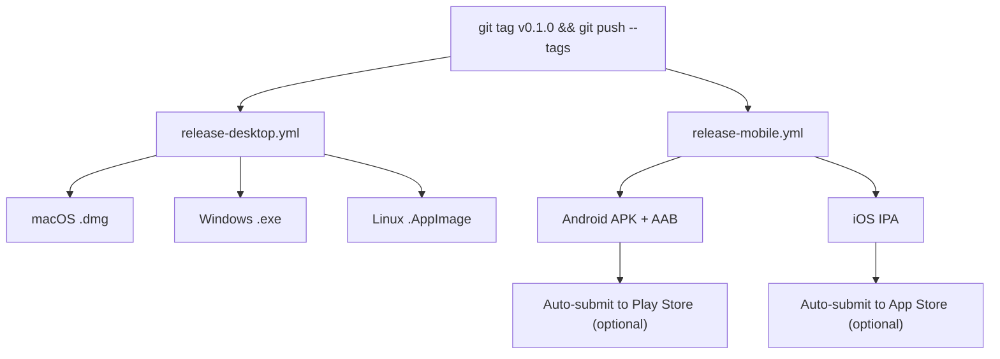
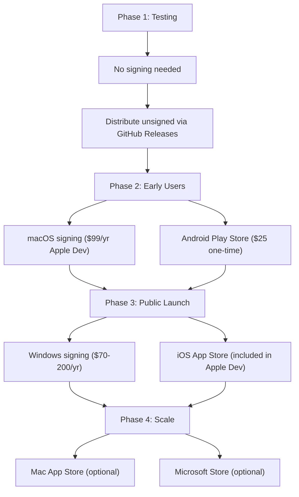
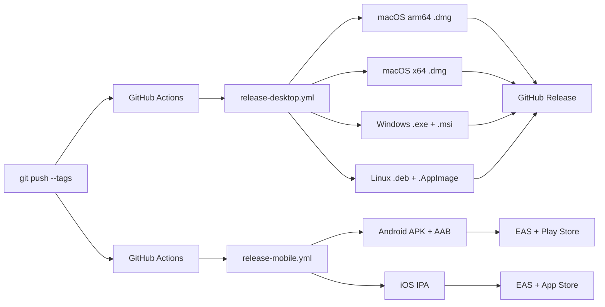

# Oh Right! — Current Build Process & Cloud Setup

> How to build locally, set up externalized cloud builds, sign apps for distribution, and where every secret goes.

---

## Table of Contents

1. [Current Local Build Process](#1-current-local-build-process)
2. [Externalize Desktop Builds (GitHub Actions)](#2-externalize-desktop-builds-github-actions)
3. [Externalize Mobile Builds (EAS)](#3-externalize-mobile-builds-eas)
4. [Code Signing — Step by Step](#4-code-signing--step-by-step)
5. [Complete Secrets Reference](#5-complete-secrets-reference)
6. [Day-to-Day Workflow](#6-day-to-day-workflow)

---

## 1. Current Local Build Process

### What you do today (on your Mac)

```bash
# Step 1: Install dependencies (one-time, or after package changes)
npm install

# Step 2: Build the shared type library
npm run build -w @ohright/shared

# Step 3: Build the React UI
npm run build -w @ohright/ui

# Step 4: Build the Tauri desktop app (compiles Rust — takes ~30s first time, ~5s incremental)
npx tauri build

# Output:
#   packages/desktop/src-tauri/target/release/bundle/macos/Oh Right!.app
#   packages/desktop/src-tauri/target/release/bundle/dmg/Oh Right!_0.0.1_aarch64.dmg
```

### Run tests

```bash
npm run test -w @ohright/shared    # 102 tests
npm run test -w @ohright/ui        # 16 tests
```

### Run in dev mode (hot-reload)

```bash
# UI only (opens in browser at localhost:1420)
npm run dev

# Full desktop app (Tauri wraps the UI)
npx tauri dev
```

### What's slow locally

| Step | Time | Can externalize? |
|------|------|-----------------|
| `npm install` | 10-20s | No (needed locally) |
| Build shared | 1-2s | Yes (CI does it) |
| Build UI (Vite) | 1-2s | Yes (CI does it) |
| Build Tauri (Rust) | 25-90s | **Yes — GitHub Actions** |
| Build mobile (Expo) | N/A | **Yes — EAS Build** |
| Windows/Linux builds | Can't do locally | **Yes — GitHub Actions** |

---

## 2. Externalize Desktop Builds (GitHub Actions)

### Already configured

The workflow `.github/workflows/release-desktop.yml` builds for **all 4 platforms** when you push a version tag.

### How to use it

```bash
# 1. Make sure everything is committed and pushed
git push origin feat/local-first-native

# 2. Tag a release
git tag v0.1.0

# 3. Push the tag — this triggers the cloud build
git push --tags

# 4. Wait ~10-15 minutes. GitHub builds:
#    - macOS ARM (Apple Silicon) → .dmg
#    - macOS x64 (Intel) → .dmg
#    - Windows → .exe + .msi
#    - Linux → .deb + .AppImage

# 5. Download from: https://github.com/h3nryza/todo_app/releases
```

> **You don't need signing secrets for unsigned builds.** CI will still build and upload unsigned binaries. Signing is only needed to avoid OS warnings when users install.

---

## 3. Externalize Mobile Builds (EAS)

### One-time setup

```bash
# Step 1: Install EAS CLI globally
npm install -g eas-cli

# Step 2: Create a free Expo account
eas login
#   → Free tier: 30 builds/month

# Step 3: Link the project
cd packages/mobile
eas init
#   → Creates/links an Expo project ID
#   → Writes project ID into app.json

# Step 4: Verify
eas whoami

# Step 5: Generate access token for CI
#   → Go to: https://expo.dev/accounts/[your-username]/settings/access-tokens
#   → Click "Create Token", name: "github-actions"
#   → Copy token → add to GitHub secrets as: EXPO_TOKEN
```

### Build commands

```bash
cd packages/mobile

# Android APK (testing)
eas build -p android --profile preview

# Android AAB (Play Store)
eas build -p android --profile production

# iOS (App Store / TestFlight)
eas build -p ios --profile production

# Submit to stores
eas submit -p android    # → Google Play
eas submit -p ios        # → App Store / TestFlight
```

### Mobile builds run in CI automatically

The workflow `.github/workflows/release-mobile.yml` triggers on the same `v*` tags as desktop. When you push a tag, **both desktop and mobile build in parallel**:



---

## 4. Code Signing — Step by Step

### Why sign?

| Platform | Without signing | With signing |
|----------|----------------|-------------|
| **macOS** | "Oh Right! is damaged and can't be opened" | Opens normally |
| **Windows** | "Windows protected your PC" (SmartScreen) | Opens normally |
| **iOS** | Can't install outside TestFlight | App Store distribution |
| **Android** | Requires "Install from unknown sources" | Play Store distribution |
| **Linux** | No issues | No issues |

---

### 4.1 macOS Code Signing + Notarization

#### Prerequisites
- Apple Developer account ($99/year) at [developer.apple.com](https://developer.apple.com)

#### Step 1: Create a Developer ID certificate

```
1. Go to developer.apple.com/account
2. Click "Certificates, IDs & Profiles"
3. Click "+" to create a new certificate
4. Select "Developer ID Application"
5. Follow the steps to create a Certificate Signing Request (CSR):
   - Open Keychain Access on your Mac
   - Menu: Keychain Access → Certificate Assistant → Request a Certificate from a CA
   - Enter your email, select "Saved to disk"
   - Upload the .certSigningRequest file to Apple
6. Download the certificate → double-click to install in Keychain
```

#### Step 2: Export as .p12 for CI

```bash
# 1. Open Keychain Access
# 2. Go to "My Certificates"
# 3. Find "Developer ID Application: Your Name (XXXXXXXXXX)"
# 4. Right-click → "Export..."
# 5. Save as .p12, set a strong password
# 6. Base64-encode it for GitHub Actions:

base64 -i ~/Desktop/OhRight-signing.p12 | pbcopy
# The encoded string is now in your clipboard
```

#### Step 3: Create app-specific password for notarization

```
1. Go to appleid.apple.com
2. Sign in
3. Go to "Sign-In and Security" → "App-Specific Passwords"
4. Click "Generate an App-Specific Password"
5. Label: "Oh Right Notarization"
6. Copy the generated password
```

#### Step 4: Find your Team ID

```
1. Go to developer.apple.com/account
2. Look under "Membership Details"
3. Your Team ID is the 10-character alphanumeric code
```

#### Step 5: Add secrets to GitHub

Go to: **GitHub repo → Settings → Secrets and variables → Actions**

| Secret Name | Value |
|-------------|-------|
| `APPLE_CERTIFICATE` | The base64 string from Step 2 |
| `APPLE_CERTIFICATE_PASSWORD` | Password you set in Step 2 |
| `APPLE_SIGNING_IDENTITY` | `Developer ID Application: Your Name (XXXXXXXXXX)` |
| `APPLE_ID` | Your Apple ID email |
| `APPLE_PASSWORD` | App-specific password from Step 3 |
| `APPLE_TEAM_ID` | 10-char Team ID from Step 4 |

#### Step 6: Verify

Push a tag → the CI builds a signed + notarized .dmg that installs without warnings.

```bash
# To verify signing locally:
codesign -dv --verbose=4 "Oh Right!.app"
# Should show: Authority=Developer ID Application: Your Name

# To verify notarization:
spctl -a -vvv "Oh Right!.app"
# Should show: source=Notarized Developer ID
```

---

### 4.2 Windows Code Signing

#### Prerequisites
- Code signing certificate from a CA ($70-200/year)
- Recommended: [SSL.com](https://ssl.com) ($70/yr OV), [Sectigo](https://sectigo.com) ($80/yr), [DigiCert](https://digicert.com) ($200/yr EV)

#### Process

```
1. Purchase an OV or EV code signing certificate
   - OV (Organization Validation): cheaper, but SmartScreen builds reputation slowly
   - EV (Extended Validation): more expensive, but instant SmartScreen trust

2. The CA will verify your identity (takes 1-5 days)

3. Once issued, you'll receive a .pfx or .p12 certificate file

4. Base64-encode it:
   # On macOS/Linux:
   base64 -i certificate.pfx | pbcopy

   # On Windows:
   certutil -encode certificate.pfx encoded.txt

5. Add to GitHub secrets:
   Secret Name: TAURI_SIGNING_PRIVATE_KEY
   Value: the base64-encoded certificate
```

> **Tip:** Start without Windows signing. SmartScreen warnings are annoying but users can click "More info → Run anyway". Get signing when you have paying users.

---

### 4.3 iOS Code Signing (EAS handles it)

EAS Build manages iOS signing automatically. You don't need to create certificates manually.

```bash
# First time: EAS prompts you to log into Apple Developer
eas build -p ios --profile production

# What happens behind the scenes:
# 1. EAS logs into your Apple Developer account
# 2. Creates a Distribution Certificate (if needed)
# 3. Creates a Provisioning Profile (if needed)
# 4. Builds and signs the IPA
# 5. You can submit directly:
eas submit -p ios
```

#### If you want to manage credentials manually:

```bash
eas credentials -p ios

# Options:
# → "Log in to your Apple Developer account"
# → "Use an existing Distribution Certificate" (if you have one)
# → "Let EAS handle it" (recommended)
```

---

### 4.4 Android Code Signing (EAS handles it)

EAS creates and manages an upload keystore automatically for Play Store builds.

```bash
# First production build — EAS creates the keystore:
eas build -p android --profile production

# The keystore is stored securely on EAS servers
# You can download a backup:
eas credentials -p android
# → Select "Download Keystore"
# → SAVE THIS FILE — if lost, you can never update your Play Store app
```

#### For Google Play submission:

```bash
# 1. Create Play Console account: play.google.com/console ($25 one-time)
# 2. Create the app listing
# 3. Submit via EAS:
eas submit -p android

# Or manually: download the AAB from the EAS build URL and upload to Play Console
```

#### Google Play service account (for automated submission):

```
1. Go to Google Cloud Console → create a service account
2. Go to Play Console → Settings → API access → link the service account
3. Grant "Release manager" permissions
4. Download the JSON key file
5. Configure in EAS:
   eas credentials -p android
   → "Set up Google Service Account Key for Play Store submissions"
   → Upload the JSON key
```

---

### 4.5 Signing Timeline (Recommended Order)



**Right now you're in Phase 1.** Everything works without signing — just some OS warnings.

---

## 5. Complete Secrets Reference

### All secrets in one place

| Secret Name | Platform | Where to Set | How to Get | Required When |
|-------------|----------|-------------|-----------|---------------|
| `APPLE_CERTIFICATE` | macOS | GitHub Actions | Keychain Access → export .p12 → `base64 -i cert.p12` | Signed macOS builds |
| `APPLE_CERTIFICATE_PASSWORD` | macOS | GitHub Actions | Password you set when exporting .p12 | Signed macOS builds |
| `APPLE_SIGNING_IDENTITY` | macOS | GitHub Actions | Keychain Access → "My Certificates" → copy name | Signed macOS builds |
| `APPLE_ID` | macOS | GitHub Actions | Your Apple ID email | Notarized macOS builds |
| `APPLE_PASSWORD` | macOS | GitHub Actions | appleid.apple.com → App-Specific Passwords | Notarized macOS builds |
| `APPLE_TEAM_ID` | macOS | GitHub Actions | developer.apple.com/account → Membership | Notarized macOS builds |
| `TAURI_SIGNING_PRIVATE_KEY` | Windows | GitHub Actions | Code signing cert from CA → base64 encode | Signed Windows builds |
| `EXPO_TOKEN` | Mobile | GitHub Actions | expo.dev → Account Settings → Access Tokens | CI mobile builds |
| `GITHUB_TOKEN` | All | (automatic) | Provided by GitHub | Always |

### Where to add GitHub secrets

```
https://github.com/h3nryza/todo_app/settings/secrets/actions

→ Click "New repository secret"
→ Enter name and value
→ Click "Add secret"
```

### Cost summary

| Service | Cost | What you get | When to buy |
|---------|------|-------------|-------------|
| GitHub Actions | **Free** | Desktop builds, CI/CD | Now (already using) |
| EAS Build | **Free** | 30 mobile builds/month | Now (set up above) |
| Apple Developer | $99/year | macOS signing + iOS | When ready for users |
| Google Play Console | $25 one-time | Android distribution | When ready for users |
| Windows code signing | $70-200/year | No SmartScreen warnings | When you have users |

---

## 6. Day-to-Day Workflow

### Development (daily)

```bash
# 1. Write code
# 2. Test locally
npm run test -w @ohright/shared

# 3. Quick desktop test (if needed)
npx tauri dev

# 4. Commit and push
git add . && git commit -m "feat: whatever" && git push
#   → CI runs: lint, type-check, tests (automatic)
```

### Release (when ready)

```bash
# 1. Bump version
./scripts/bump-version.sh 0.1.0

# 2. Commit the version bump
git add -A && git commit -m "chore: bump version to 0.1.0"

# 3. Tag and push — triggers ALL cloud builds (desktop + mobile)
git tag v0.1.0
git push && git push --tags

# 4. Everything happens automatically:
#    Desktop (~10-15 min): .dmg, .exe, .msi, .deb, .AppImage → GitHub Releases
#    Mobile (~15-20 min): APK, AAB, IPA → EAS dashboard + optional store submission
```

### Complete pipeline



### What you never build locally again

Everything. Push a tag → go get coffee → all 7 platform binaries ready when you get back.
