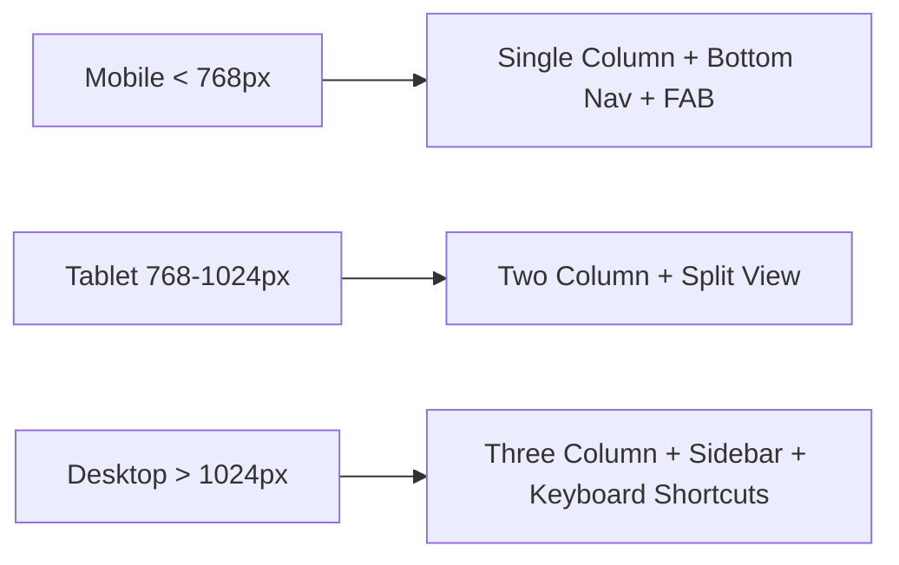

# RemindMe — Design Specification v1.0

> Layout, component design, responsive behavior, and interaction patterns.

---

## Design Principles

1. **One-hand friendly**: Primary actions reachable with thumb on mobile
2. **3-tap max**: Any action should take at most 3 taps from the home screen
3. **Glanceable**: Home screen shows what's due today/soon at a glance
4. **No surprises**: Familiar patterns (FAB, swipe actions, pull-to-refresh)
5. **Accessible**: WCAG 2.1 AA compliant, supports dark mode and reduced motion

---

## Color System

| Token | Light Mode | Dark Mode | Usage |
|-------|-----------|-----------|-------|
| `--bg-primary` | `#FFFFFF` | `#1A1A2E` | Main background |
| `--bg-secondary` | `#F5F5F7` | `#16213E` | Cards, sections |
| `--text-primary` | `#1A1A2E` | `#EAEAEA` | Headings, body |
| `--text-secondary` | `#6B7280` | `#9CA3AF` | Labels, hints |
| `--accent` | `#4F46E5` | `#818CF8` | Buttons, links, active states |
| `--success` | `#10B981` | `#34D399` | Completed items |
| `--warning` | `#F59E0B` | `#FBBF24` | Due soon |
| `--danger` | `#EF4444` | `#F87171` | Overdue, delete |

---

## Typography

| Element | Size | Weight | Font |
|---------|------|--------|------|
| Page title | 24px / 1.5rem | 700 | Inter |
| Section header | 18px / 1.125rem | 600 | Inter |
| Body text | 16px / 1rem | 400 | Inter |
| Caption / label | 14px / 0.875rem | 400 | Inter |
| Small / badge | 12px / 0.75rem | 500 | Inter |

---

## Screen Layouts

### 1. Home Screen

```
┌──────────────────────────────────────┐
│  RemindMe                    ⚙️  👤   │  ← App bar: title, settings, profile
├──────────────────────────────────────┤
│  🔍 Search reminders...              │  ← Search bar
├──────────────────────────────────────┤
│                                      │
│  ── TODAY ──────────────────────────  │
│  ┌────────────────────────────────┐  │
│  │ 💊 Take medication    8:00 AM  │  │  ← Reminder card
│  │    Daily · Health      ✓ 2/3   │  │     Subtask progress shown
│  └────────────────────────────────┘  │
│  ┌────────────────────────────────┐  │
│  │ 💰 Pay electricity   5:00 PM   │  │
│  │    Monthly · Bills             │  │
│  └────────────────────────────────┘  │
│                                      │
│  ── UPCOMING ───────────────────────  │
│  ┌────────────────────────────────┐  │
│  │ 📋 Weekly report     Mon 9 AM  │  │
│  │    Weekly · Work               │  │
│  └────────────────────────────────┘  │
│  ┌────────────────────────────────┐  │
│  │ 🏠 Pay rent          Apr 1     │  │
│  │    Monthly · Bills             │  │
│  └────────────────────────────────┘  │
│                                      │
│                              ┌─────┐ │
│                              │  +  │ │  ← FAB: New Reminder
│                              └─────┘ │
├──────────────────────────────────────┤
│  🏠 Home    📋 All    🏷️ Types   ⚙️  │  ← Bottom nav (mobile)
└──────────────────────────────────────┘
```

**Behavior:**
- Cards sorted by next trigger time
- Swipe left on card → Snooze / Skip
- Swipe right on card → Complete this occurrence
- Pull down → Refresh
- Overdue reminders pinned to top with red accent

### 2. New Reminder Screen

```
┌──────────────────────────────────────┐
│  ← New Reminder              Save ✓  │
├──────────────────────────────────────┤
│                                      │
│  Reminder Name                       │
│  ┌────────────────────────────────┐  │
│  │ Pay electricity bill           │  │
│  └────────────────────────────────┘  │
│                                      │
│  Category                            │
│  ┌────────────────────────────────┐  │
│  │ 💰 Bills                    ▼  │  │  ← Dropdown with favorites first
│  └────────────────────────────────┘  │
│  ⭐ Bills  ⭐ Health  Work  Personal │  ← Quick-pick chips (favorites)
│                                      │
│  Schedule                            │
│  ┌──────┐┌──────┐┌───────┐┌──────┐  │
│  │ Once ││Daily ││Weekly ││Month.│  │  ← Toggle chips
│  └──────┘└──────┘└───────┘└──────┘  │
│  ┌──────┐┌──────┐┌───────┐          │
│  │Yearly││Custom││Hourly │          │
│  └──────┘└──────┘└───────┘          │
│                                      │
│  Date & Time                         │
│  ┌─────────────┐ ┌────────────────┐  │
│  │ 📅 Apr 1    │ │ 🕐 9:00 AM    │  │
│  └─────────────┘ └────────────────┘  │
│                                      │
│  ── Optional ────────────────────    │
│  [+ Add subtasks]                    │
│  [+ Add notes]                       │
│                                      │
│            ┌──────────────────┐      │
│            │   Save Reminder  │      │
│            └──────────────────┘      │
└──────────────────────────────────────┘
```

**Behavior:**
- Category field: auto-suggests as user types, favorites at top
- Star icon next to category → toggle favorite
- Schedule chips: selecting one reveals relevant options (day picker for weekly, date picker for monthly, etc.)
- Save validates: name required, schedule required, date/time required

### 3. Reminder Detail Page

```
┌──────────────────────────────────────┐
│  ← Back                    ⋮ Menu    │
├──────────────────────────────────────┤
│                                      │
│  💰 Pay Electricity Bill             │
│  ━━━━━━━━━━━━━━━━━━━━━━━━━━━━━━━━━  │
│  📁 Bills · 📅 Monthly on the 1st   │
│  Next: April 1, 2026 at 9:00 AM     │
│  Status: ● Active                    │
│                                      │
├──────────────────────────────────────┤
│  📋 SUBTASKS                  [+ Add]│
│  ┌────────────────────────────────┐  │
│  │ ☑ Log into utility portal     │  │
│  │ ☐ Check amount due            │  │
│  │ ☐ Make payment                │  │
│  │ ☐ Save confirmation number    │  │
│  └────────────────────────────────┘  │
│  Progress: ████░░░░░░ 1/4            │
│                                      │
├──────────────────────────────────────┤
│  📝 NOTES                    [Edit]  │
│  ┌────────────────────────────────┐  │
│  │ Account #: 1234-5678          │  │
│  │ Portal: utility.example.com   │  │
│  │ Usually ~$150/month           │  │
│  └────────────────────────────────┘  │
│                                      │
├──────────────────────────────────────┤
│  📜 HISTORY                          │
│  ┌────────────────────────────────┐  │
│  │ ✓ Mar 1, 2026  — Completed    │  │
│  │ ✓ Feb 1, 2026  — Completed    │  │
│  │ ✗ Jan 1, 2026  — Skipped      │  │
│  └────────────────────────────────┘  │
│                                      │
│  ┌─────────────────────────────────┐ │
│  │  ✅ Complete & Schedule Next    │ │  ← Primary action
│  └─────────────────────────────────┘ │
│  ┌────────┐ ┌────────┐ ┌──────────┐ │
│  │ Snooze │ │  Skip  │ │  Pause   │ │  ← Secondary actions
│  └────────┘ └────────┘ └──────────┘ │
└──────────────────────────────────────┘
```

**Behavior:**
- Subtasks: tap to toggle, long press to reorder, swipe to delete
- "Complete & Schedule Next" → marks this occurrence done, auto-calculates next trigger
- Notes: rich text area, supports links
- History: scrollable list, most recent first
- Menu (⋮): Edit, Duplicate, Share as template, Delete

### 4. Categories Management Screen

```
┌──────────────────────────────────────┐
│  ← Categories                [+ New] │
├──────────────────────────────────────┤
│                                      │
│  ── FAVORITES ──────────────────────  │
│  ┌────────────────────────────────┐  │
│  │ ⭐ 💰 Bills         12 items  │  │
│  │ ⭐ 💊 Health          5 items  │  │
│  └────────────────────────────────┘  │
│                                      │
│  ── ALL CATEGORIES ─────────────────  │
│  ┌────────────────────────────────┐  │
│  │    💼 Work             8 items │  │
│  │    👤 Personal         3 items │  │
│  │    🏠 Home             6 items │  │
│  │    🛒 Shopping         2 items │  │
│  └────────────────────────────────┘  │
│                                      │
└──────────────────────────────────────┘
```

### 5. Settings Screen

```
┌──────────────────────────────────────┐
│  ← Settings                          │
├──────────────────────────────────────┤
│                                      │
│  NOTIFICATIONS                       │
│  ┌────────────────────────────────┐  │
│  │ Push notifications    [ON/OFF] │  │
│  │ Test notification     [Test ▶] │  │  ← Sends a test push
│  │ Quiet hours         10PM-7AM   │  │
│  │ Default reminder time  9:00 AM │  │
│  └────────────────────────────────┘  │
│                                      │
│  ACCOUNT                             │
│  ┌────────────────────────────────┐  │
│  │ Email: user@example.com       │  │
│  │ Export data            [JSON]  │  │
│  │ Import data           [Upload] │  │
│  │ Sign out                       │  │
│  └────────────────────────────────┘  │
│                                      │
│  APPEARANCE                          │
│  ┌────────────────────────────────┐  │
│  │ Theme          [System/Light/Dark]│
│  │ First day of week    [Mon/Sun] │  │
│  └────────────────────────────────┘  │
│                                      │
│  PERMISSIONS                         │
│  ┌────────────────────────────────┐  │
│  │ Notification status:  ✅ OK    │  │
│  │ Battery optimization: ⚠️ Fix   │  │  ← Links to OS settings
│  │ Background refresh:   ✅ OK    │  │
│  └────────────────────────────────┘  │
│                                      │
│  ABOUT                               │
│  ┌────────────────────────────────┐  │
│  │ Version 1.0.0                  │  │
│  │ Privacy Policy                 │  │
│  │ Open Source Licenses           │  │
│  └────────────────────────────────┘  │
└──────────────────────────────────────┘
```

---

## Responsive Behavior

### Mobile (< 768px)
- Single column layout
- Bottom navigation bar
- FAB for new reminder
- Full-screen modals for creation/editing
- Swipe gestures enabled

### Tablet (768px - 1024px)
- Two-column: reminder list (left) + detail (right)
- Side navigation or bottom nav
- FAB for new reminder
- Modal overlays instead of full-screen

### Desktop (> 1024px)
- Three-column: sidebar nav (left) + reminder list (center) + detail (right)
- Keyboard shortcuts (N = new, / = search, J/K = navigate list)
- No FAB — "New Reminder" button in sidebar
- Hover states on cards



---

## Component Library

| Component | Description | States |
|-----------|-------------|--------|
| `ReminderCard` | Home screen list item | default, due-today, overdue, completed |
| `CategoryChip` | Color-coded category badge | default, selected, favorite |
| `SchedulePicker` | Schedule type selector | collapsed, expanded, each type variant |
| `SubtaskItem` | Checkable subtask row | unchecked, checked, editing, dragging |
| `FAB` | Floating action button | default, pressed, hidden (on scroll down) |
| `NotificationBanner` | In-app notification | info, warning, success, error |
| `PermissionPrompt` | OS permission request with explanation | asking, granted, denied, settings-link |
| `EmptyState` | Shown when no reminders exist | first-time, filtered-empty |

---

## Animation & Transitions

| Interaction | Animation | Duration |
|------------|-----------|----------|
| Page navigation | Slide left/right | 250ms ease-out |
| Card appear | Fade in + slide up | 200ms ease-out |
| Subtask check | Checkbox fill + strikethrough | 150ms |
| FAB press | Scale down 0.95 → back | 100ms |
| Swipe action | Reveal color background | follows finger |
| Delete | Shrink height to 0 | 200ms ease-in |

All animations respect `prefers-reduced-motion`.

---

## Notification Design

### Push Notification (All Platforms)
```
┌──────────────────────────────────┐
│ 🔔 RemindMe                     │
│ Pay electricity bill             │
│ Bills · 4 subtasks               │
│                    [Open] [Snooze]│
└──────────────────────────────────┘
```

### Actionable Notifications (where supported)
- **Open**: Opens the reminder detail page
- **Snooze**: Reschedule +15 minutes (configurable)
- **Complete**: Mark as done (for reminders without subtasks)
