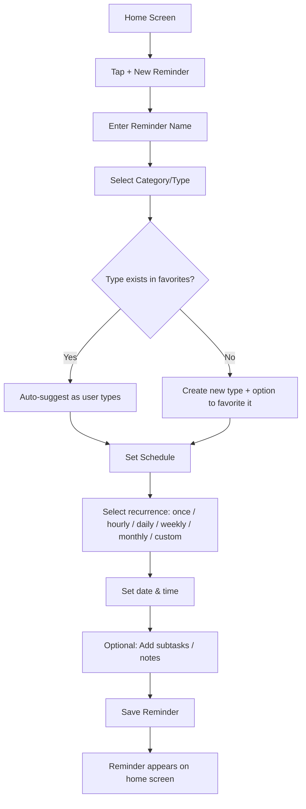
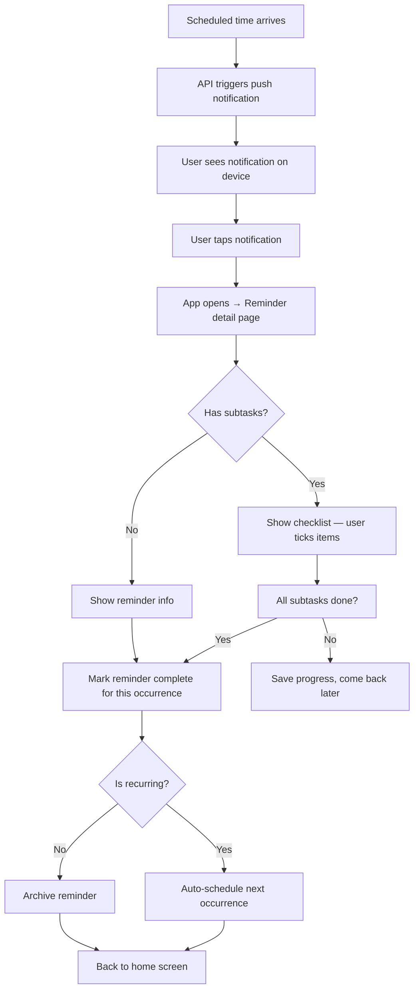

# RemindMe — Product Specification v1.0

> A dead-simple, cross-platform reminder app that helps you never forget anything.

---

## Vision

RemindMe is a **single-purpose app**: create reminders, get notified, check off subtasks, repeat. No bloat, no project management, no Gantt charts. Just reminders that work reliably on every device you own.

---

## Core Problem

People forget recurring tasks — paying bills, taking medication, weekly reports, monthly maintenance. Existing tools are either too complex (Todoist, Notion) or too limited (phone alarms). RemindMe sits in the sweet spot: **powerful scheduling + dead-simple UI**.

---

## Target Platforms

| Platform | Delivery | Min Version |
|----------|----------|-------------|
| Web | Progressive Web App (PWA) | Modern browsers (Chrome 90+, Firefox 90+, Safari 16+) |
| macOS | Electron app + PWA | macOS 12+ |
| Windows | Electron app + PWA | Windows 10+ |
| Linux | Electron app + PWA | Ubuntu 20.04+, Fedora 36+ |
| Android | React Native (Expo) | Android 10+ (API 29) |
| iOS | React Native (Expo) | iOS 15+ |

---

## User Flows

### Flow 1: Create a Reminder



### Flow 2: Reminder Fires



### Flow 3: Reminder Detail Page

When a user opens a reminder, they see a **dedicated page** with:

- **Header**: Reminder name, category badge, next scheduled time
- **Schedule summary**: "Every Monday at 9:00 AM" or "Monthly on the 15th"
- **Subtasks section**: Checkable list items, add/remove/reorder
- **Notes section**: Free-text area for additional info (e.g., account numbers, links, instructions)
- **History**: Log of past completions (date + time completed)
- **Actions**: Edit, Snooze, Skip this occurrence, Delete, Pause/Resume

---

## Reminder Schedule Types

| Type | Description | Example |
|------|-------------|---------|
| **Once** | Single occurrence | "Pay registration fee on March 30" |
| **Hourly** | Every N hours | "Drink water every 2 hours" |
| **Daily** | Every N days at a set time | "Take medication at 8 AM daily" |
| **Weekly** | Specific days of the week | "Team standup Mon/Wed/Fri at 9 AM" |
| **Monthly (date)** | Specific day of month | "Pay rent on the 1st" |
| **Monthly (weekday)** | e.g., "2nd Tuesday of month" | "Book club, 2nd Tuesday" |
| **Yearly** | Annual reminders | "Car registration renewal, June 15" |
| **Custom cron** | Advanced users: cron expression | "*/30 9-17 * * 1-5" (every 30min during work hours weekdays) |
| **Day-before** | Triggers N days before a date | "Remind 3 days before rent is due" |

---

## Category / Type System

- Users can create **custom categories** (e.g., "Bills", "Health", "Work", "Home")
- Each category has a **color** and **icon** (from a preset icon library)
- Categories are **favoritable** — starred categories appear first in the picker
- **Auto-suggest**: As the user types a category name, previously used categories appear
- **Default categories** ship with the app: Bills, Health, Work, Personal, Home, Shopping

---

## Data Model (API Resources)

### Reminder
```
{
  id: UUID,
  userId: UUID,
  name: string,
  description: string | null,
  categoryId: UUID,
  schedule: {
    type: "once" | "hourly" | "daily" | "weekly" | "monthly_date" | "monthly_weekday" | "yearly" | "cron",
    interval: number | null,        // e.g., every 2 hours
    daysOfWeek: number[] | null,    // 0=Sun, 1=Mon, etc.
    dayOfMonth: number | null,
    weekOfMonth: number | null,     // for "2nd Tuesday" type
    cronExpression: string | null,
    startDate: ISO8601,
    endDate: ISO8601 | null,
    timeOfDay: "HH:mm",
    timezone: string                // IANA timezone
  },
  nextTriggerAt: ISO8601,
  status: "active" | "paused" | "completed" | "archived",
  subtasks: Subtask[],
  notes: string | null,
  history: CompletionRecord[],
  createdAt: ISO8601,
  updatedAt: ISO8601
}
```

### Subtask
```
{
  id: UUID,
  reminderId: UUID,
  title: string,
  isCompleted: boolean,
  sortOrder: number,
  createdAt: ISO8601
}
```

### Category
```
{
  id: UUID,
  userId: UUID,
  name: string,
  color: string,          // hex color
  icon: string,           // icon identifier
  isFavorite: boolean,
  usageCount: number,     // for smart sorting
  createdAt: ISO8601
}
```

### CompletionRecord
```
{
  id: UUID,
  reminderId: UUID,
  scheduledFor: ISO8601,
  completedAt: ISO8601,
  subtaskSnapshot: { title: string, completed: boolean }[]
}
```

---

## Push Notification Strategy

| Platform | Technology | Notes |
|----------|-----------|-------|
| Android | Firebase Cloud Messaging (FCM) | Requires google-services.json |
| iOS | Apple Push Notification service (APNs) via FCM | Requires APNs key + FCM config |
| Web | Web Push API (VAPID keys) | Service worker required |
| macOS (Electron) | Electron Notification API + FCM fallback | Native OS notifications |
| Windows (Electron) | Electron Notification API + Windows Toast | Native OS notifications |
| Linux (Electron) | Electron Notification API + libnotify | Varies by desktop environment |

**Server-side**: A scheduled job processor (BullMQ + Redis) evaluates reminders and dispatches push notifications through the appropriate channel.

---

## Permissions Required Per Platform

### iOS
| Permission | Why | When to Request |
|-----------|-----|-----------------|
| Notifications | Push notifications for reminders | On first reminder creation |
| Background App Refresh | Keep reminder state in sync | After notification permission granted |

### Android
| Permission | Why | When to Request |
|-----------|-----|-----------------|
| `POST_NOTIFICATIONS` | Push notifications (Android 13+) | On first reminder creation |
| `SCHEDULE_EXACT_ALARM` | Precise reminder timing | On first reminder creation |
| `REQUEST_IGNORE_BATTERY_OPTIMIZATIONS` | Prevent OS from killing notification delivery | Settings guidance screen |
| `RECEIVE_BOOT_COMPLETED` | Reschedule alarms after device restart | Automatically at install |

### macOS
| Permission | Why | When to Request |
|-----------|-----|-----------------|
| Notifications | OS notification center | On first app launch or first reminder |

### Windows
| Permission | Why | When to Request |
|-----------|-----|-----------------|
| Notifications | Toast notifications | Usually auto-granted; prompt if disabled |

### Linux
| Permission | Why | When to Request |
|-----------|-----|-----------------|
| D-Bus notifications | Desktop notifications | Usually auto-available |

### Web (All Browsers)
| Permission | Why | When to Request |
|-----------|-----|-----------------|
| Notification | Web Push API | On first reminder creation |
| Service Worker | Background push reception | Auto-registered on app load |

**UX Rule**: Never ask for permissions on app launch. Ask **in context** — when the user creates their first reminder, explain why the permission is needed, then request it.

---

## Sync Strategy

### Phase 1: API is the Source of Truth
- All data lives on the server
- Clients are thin — they fetch and display
- Offline: queue changes locally, sync when reconnected (optimistic UI)

### Phase 2: Export / Import
- Export all reminders as JSON or CSV
- Import from JSON file (for backup/restore or migration between accounts)
- Shareable reminder templates (e.g., "Monthly bill payment checklist")

### Phase 3: Cloud Integration (Future)
- Google Calendar sync (2-way)
- Apple Calendar / iCloud Reminders sync
- Microsoft To-Do / Outlook sync
- These are stretch goals — the API-first approach means sync is already handled

---

## Non-Functional Requirements

| Requirement | Target |
|------------|--------|
| API response time | < 200ms p95 |
| Push notification delivery | < 5 seconds from scheduled time |
| Offline tolerance | App works offline; syncs within 30s of reconnection |
| Uptime | 99.9% (API) |
| Data retention | Completion history kept for 2 years |
| Max reminders per user | 500 (free tier), unlimited (paid, future) |
| Max subtasks per reminder | 50 |
