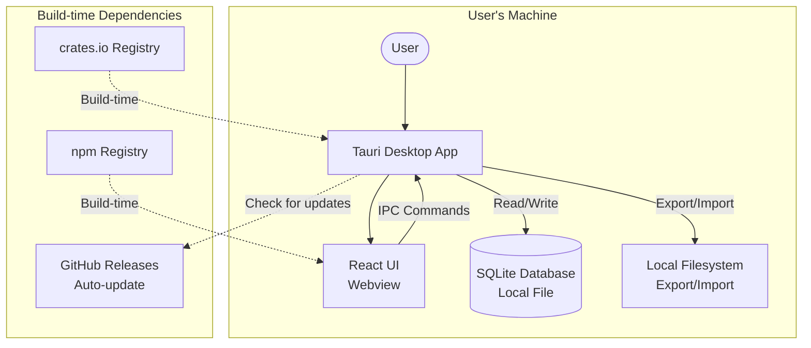
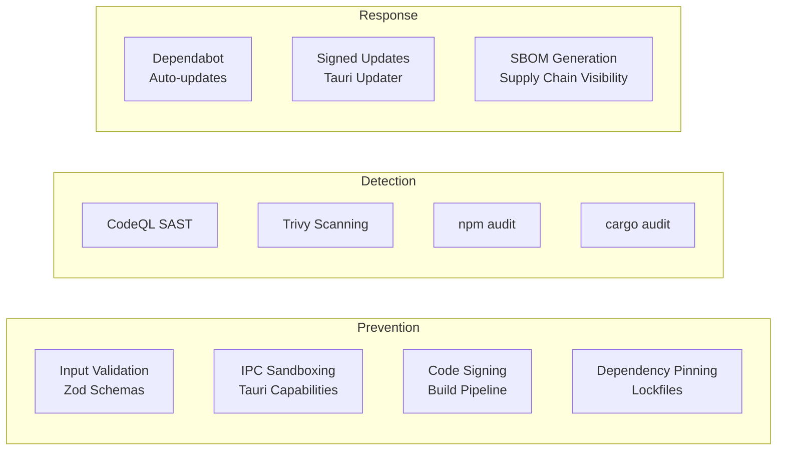

# Oh Right! Threat Model

> **Updated 2026-03-23:** Architecture changed to local-first. Server-side threats (API flooding, SQL injection, JWT theft) are no longer applicable. Remaining threats focus on local data security, app integrity, and supply chain.

This document provides a STRIDE-based threat model for the Oh Right! cross-platform reminder application.

## System Overview

Oh Right! is a local-first cross-platform reminder application consisting of:

- **Desktop App** (Tauri v2) -- Native desktop application for macOS, Windows, and Linux
- **UI Layer** (React) -- Frontend rendered in the Tauri webview
- **Shared Package** -- Types, schemas, and utilities shared across packages
- **SQLite** -- Local database for reminders, categories, and settings (via Tauri plugin)

There is no server component. All data is stored locally on the user's machine.

## Data Flow Diagram

## Trust Boundaries

| Boundary | Description |
|----------|-------------|
| **User <-> App** | User interacts with the app through the native window. Input is validated by Zod schemas. |
| **Webview <-> Tauri Core** | IPC bridge between the frontend (untrusted web context) and the Rust backend. Commands are explicitly exposed. |
| **App <-> Filesystem** | The app reads/writes SQLite data and JSON exports to the local filesystem. |
| **App <-> Update Server** | The app may check GitHub Releases for updates. Downloads must be signed. |

## STRIDE Analysis

### Spoofing

| Threat | Component | Risk | Mitigation |
|--------|-----------|------|------------|
| Malicious app impersonation | Desktop App | Medium | Code signing for distributed builds; users should only download from official GitHub Releases |
| Tampered auto-update | Update mechanism | High | Tauri updater verifies signatures; updates served over HTTPS from GitHub Releases |

### Tampering

| Threat | Component | Risk | Mitigation |
|--------|-----------|------|------------|
| Direct modification of SQLite file | Local filesystem | Medium | File permissions restrict access to the current user; app uses the OS-standard app data directory |
| IPC command injection from webview | Webview <-> Tauri | Medium | Tauri v2 capabilities system restricts which commands the webview can invoke; input validated with Zod schemas |
| Tampered JSON import file | Import feature | Medium | Import data validated against Zod schemas before processing; malformed data rejected |
| Modified app binary | Desktop App | Medium | Code signing ensures binary integrity; unsigned builds produce OS warnings |

### Repudiation

| Threat | Component | Risk | Mitigation |
|--------|-----------|------|------------|
| User denies modifying a reminder | Local app | Low | Local-only app; no multi-user scenario; `updatedAt` timestamps maintained on all records |

### Information Disclosure

| Threat | Component | Risk | Mitigation |
|--------|-----------|------|------------|
| SQLite database readable by other local processes | Local filesystem | Medium | Database stored in OS app data directory with user-level file permissions; sensitive data should not be stored in reminders |
| Exported JSON contains sensitive reminder data | Export feature | Medium | User explicitly triggers export; export file location chosen by user; no automatic sharing |
| Webview dev tools exposing app state | Desktop App | Low | Dev tools disabled in production builds |
| Crash reports leaking data | Desktop App | Low | No telemetry or crash reporting in v1; if added, must be opt-in with data minimization |

### Denial of Service

| Threat | Component | Risk | Mitigation |
|--------|-----------|------|------------|
| Corrupted SQLite database | Local storage | Medium | SQLite WAL mode for crash resilience; future: periodic backup of database file |
| Extremely large import file | Import feature | Low | Import size validated; batch processing with limits |
| Resource exhaustion from excessive reminders | Desktop App | Low | Pagination in UI; SQLite handles large datasets efficiently |

### Elevation of Privilege

| Threat | Component | Risk | Mitigation |
|--------|-----------|------|------------|
| Webview escaping sandbox to access Tauri APIs | Webview <-> Tauri | High | Tauri v2 capabilities system; only explicitly allowed commands are accessible from webview |
| Malicious Tauri plugin | Build-time | Medium | Only use well-maintained, audited Tauri plugins; pin dependency versions |
| Supply chain attack via npm/cargo dependency | Build-time | Medium | Dependabot monitoring; npm audit and cargo audit in CI; lockfile pinning |

## Attack Surface Analysis

| Surface | Exposure | Controls |
|---------|----------|----------|
| Local SQLite database | Local filesystem (user-level access) | OS file permissions; app data directory |
| Tauri IPC bridge | Webview to Rust core | Capabilities system; Zod validation on all commands |
| JSON import/export | User-initiated file operations | Schema validation; size limits |
| Auto-update channel | HTTPS to GitHub Releases | Signature verification; HTTPS transport |
| npm dependencies | Build-time only | Dependabot; npm audit in CI; lockfile |
| Cargo dependencies | Build-time and runtime | Dependabot; cargo audit in CI; lockfile |

## Security Controls Summary

## Residual Risks

These risks are acknowledged and accepted for v1:

| Risk | Severity | Rationale |
|------|----------|-----------|
| No encryption at rest for SQLite database | Medium | Reminder data is not considered highly sensitive; OS file permissions provide baseline protection; SQLCipher integration planned for future release |
| No backup/restore mechanism | Medium | SQLite file can be manually backed up; automated backup planned for v1.1 |
| Unsigned development builds | Low | Only affects local development; release builds will be code-signed |
| No telemetry for detecting issues | Low | Privacy-first approach; opt-in diagnostics may be added later |
| Local data not wiped on app uninstall | Low | Standard behavior for desktop apps; user can manually delete app data directory |

## Review Schedule

This threat model should be reviewed:

- Before each major release
- When new features are added (e.g., sync, cloud backup, sharing)
- When the architecture changes (e.g., adding a server component)
- Quarterly at minimum
