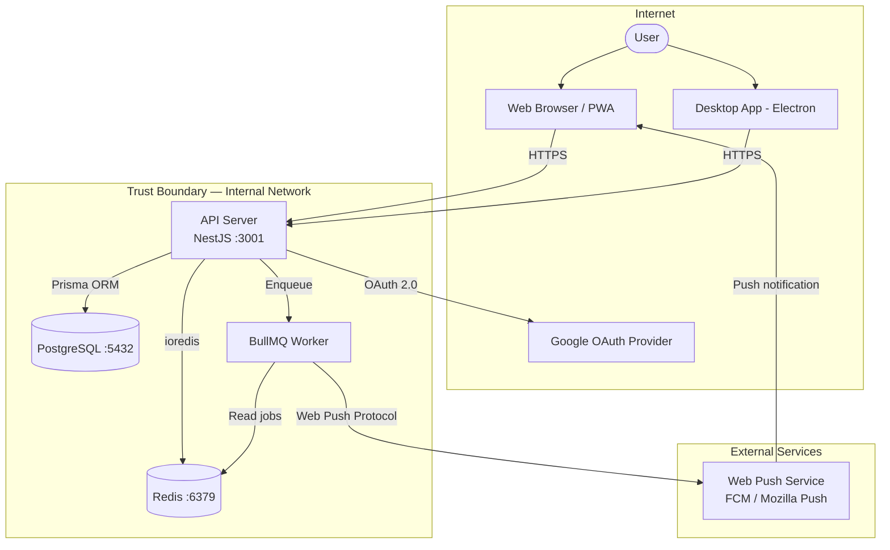
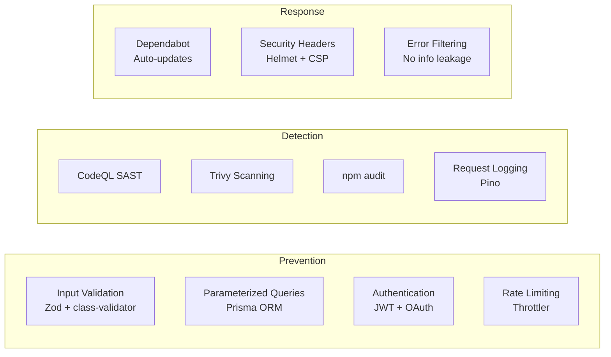

# RemindMe Threat Model

This document provides a STRIDE-based threat model for the RemindMe cross-platform reminder application.

## System Overview

RemindMe is a cross-platform reminder application consisting of:

- **API Server** (NestJS) -- REST API handling authentication, reminder CRUD, and push notification scheduling
- **PostgreSQL** -- Primary data store for users, reminders, and categories
- **Redis** -- Session cache, rate limiting state, and BullMQ job queue for scheduled notifications
- **Web Client** (React PWA) -- Browser-based frontend with offline support
- **Desktop Client** (Electron) -- macOS desktop application wrapping the web client
- **Push Notification Services** -- Web Push (VAPID) for browser notifications

## Data Flow Diagram

## Trust Boundaries

| Boundary | Description |
|----------|-------------|
| **Client <-> API** | All client-to-server communication crosses the internet. Must use HTTPS. Input is untrusted. |
| **API <-> Database** | Internal network. API is the sole accessor. Connections use credentials. |
| **API <-> Redis** | Internal network. Used for caching, rate limits, and job queues. |
| **API <-> External OAuth** | Outbound to Google. Tokens validated server-side. |
| **API <-> Push Services** | Outbound to web push endpoints. VAPID-signed payloads. |

## STRIDE Analysis

### Spoofing

| Threat | Component | Risk | Mitigation |
|--------|-----------|------|------------|
| JWT token theft via XSS | Web Client | High | httpOnly cookies prevent JavaScript access to tokens; Content Security Policy blocks inline scripts |
| Session hijacking via network interception | Client <-> API | High | HTTPS enforced in production; HSTS headers; Secure cookie flag |
| OAuth token replay | API <-> OAuth | Medium | State parameter validation; short-lived authorization codes; server-side token exchange |
| Refresh token theft | API | High | Refresh token rotation — each token is single-use; old tokens invalidate the family on reuse detection |
| Credential stuffing on login | API /auth/login | Medium | Rate limiting (10/min on auth endpoints); bcrypt with cost factor 12 |

### Tampering

| Threat | Component | Risk | Mitigation |
|--------|-----------|------|------------|
| API request parameter manipulation | API | High | Zod schema validation on all inputs; class-validator on DTOs; reject unexpected fields |
| SQL injection | API <-> PostgreSQL | Critical | Prisma ORM uses parameterized queries exclusively; no raw SQL |
| XSS in reminder titles, notes, or category names | Web Client | High | React auto-escapes output by default; CSP headers block inline scripts; input length limits enforced |
| CSRF on state-changing endpoints | API | Medium | SameSite=Strict cookies; Origin header validation |
| Tampered push notification payloads | Queue <-> Push Service | Low | VAPID signing ensures payload integrity; push services verify signatures |

### Repudiation

| Threat | Component | Risk | Mitigation |
|--------|-----------|------|------------|
| User denies modifying a reminder | API | Low | `updatedAt` timestamps on all records; completion records with timestamps |
| Unauthorized API calls without audit trail | API | Medium | Structured request logging via Pino with request ID, user ID, method, and path; no sensitive data in logs |
| Deleted reminders with no record | API | Low | Soft-delete pattern preserves records; completion history maintained separately |

### Information Disclosure

| Threat | Component | Risk | Mitigation |
|--------|-----------|------|------------|
| User data exposure via IDOR | API | Critical | Ownership checks on every query — all data access filtered by authenticated user ID |
| Token leakage in error responses or logs | API | High | Centralized exception filter strips internal details in production; Pino configured to redact authorization headers |
| Stack traces in production errors | API | Medium | `NODE_ENV=production` returns structured error responses with no stack traces |
| Database credentials in environment | Infrastructure | High | Environment variables only; `.env` files in `.gitignore`; no secrets in Docker images |
| Sensitive data in browser storage | Web Client | Medium | No tokens in localStorage; httpOnly cookies only; IndexedDB used only for offline reminder cache |

### Denial of Service

| Threat | Component | Risk | Mitigation |
|--------|-----------|------|------------|
| API flooding | API | High | Global rate limit: 100 requests/min per IP via `@nestjs/throttler` |
| Brute force on authentication | API /auth | High | Auth-specific rate limit: 10 requests/min per IP |
| Expensive database queries | API <-> PostgreSQL | Medium | Pagination on all list endpoints (max 100 per page); query complexity limited by Prisma schema |
| Large import payloads | API | Medium | Request body size limit (1MB); import batch size limits; validation before processing |
| Redis memory exhaustion | Redis | Medium | TTL on all cached keys; maxmemory policy configured; BullMQ job retention limits |

### Elevation of Privilege

| Threat | Component | Risk | Mitigation |
|--------|-----------|------|------------|
| Accessing other users' reminders | API | Critical | JWT-scoped user ID; every database query includes `WHERE userId = authenticatedUser.id` |
| Modifying other users' categories | API | Critical | Ownership validation middleware; Prisma queries always scoped to user |
| Admin endpoint access | API | Low | No admin endpoints in v1; future admin role will require separate JWT claim and middleware |
| Container escape | Infrastructure | Low | Non-root container user (uid 1001); minimal Alpine base image; no privileged mode |

## Attack Surface Analysis

| Surface | Exposure | Controls |
|---------|----------|----------|
| REST API endpoints | Public internet | Authentication required (except /auth, /health); rate limiting; input validation |
| Web client (SPA) | Public internet | CSP headers; Subresource Integrity; no inline scripts |
| PostgreSQL | Internal network only | Credentials required; no public binding; connection pooling |
| Redis | Internal network only | AUTH enabled in production; no public binding |
| Docker images | GitHub Container Registry | Trivy scanned; non-root user; minimal base image |
| npm dependencies | Build time | Dependabot; npm audit in CI; dependency review on PRs |

## Security Controls Summary

## Residual Risks

These risks are acknowledged and accepted for v1:

| Risk | Severity | Rationale |
|------|----------|-----------|
| No email verification on signup | Medium | Planned for v1.1; current impact limited since no email-based features exist |
| No account lockout after failed attempts | Medium | Rate limiting provides partial mitigation; full lockout planned for v1.1 |
| No encryption at rest for reminder content | Low | Reminder data is not considered highly sensitive (no financial/health data); database access is restricted |
| Single-region deployment | Medium | Acceptable for initial user base; multi-region planned for scale phase |
| No WAF in front of API | Medium | Rate limiting and input validation provide baseline protection; WAF to be added when traffic warrants it |
| Push notification content visible to push service | Low | Notification payloads contain minimal data (title only); no sensitive reminder content in push payload |
| No MFA support | Medium | OAuth (Google) provides delegated MFA; native MFA planned for v1.2 |

## Review Schedule

This threat model should be reviewed:

- Before each major release
- When new components are added (e.g., mobile app, new OAuth providers)
- When the deployment architecture changes
- Quarterly at minimum
