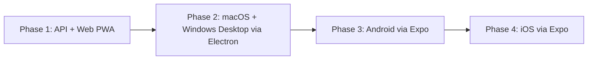
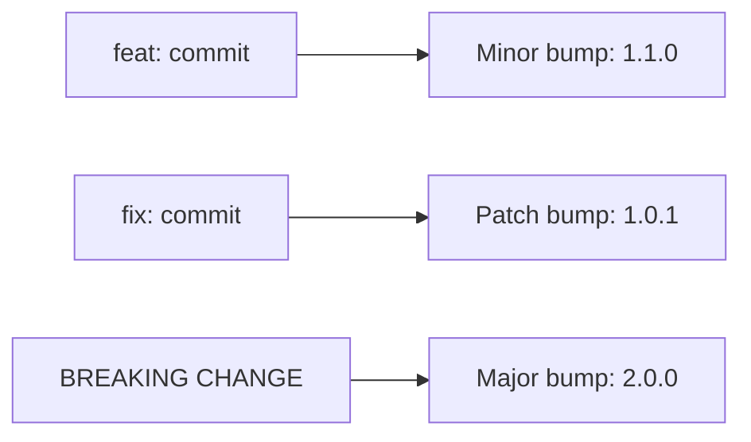

# RemindMe — Recommendations

> Technical and strategic recommendations based on 10 iterations of analysis.

---

## 1. Start with Web + API, Ship Fast

**Recommendation**: Build the API and web app first. Get it working perfectly. Then wrap it.

**Why**: The web app is the fastest to iterate on. The Electron desktop app is literally the web app in a shell — minimal extra work. Mobile comes last because it requires app store review, provisioning profiles, and more complex push notification setup.

---

## 2. Use NestJS, Not Express

**Recommendation**: NestJS over raw Express/Fastify.

**Why**:
- Built-in module system → clean separation of concerns
- Built-in validation (class-validator + class-transformer or Zod)
- Auto-generated Swagger/OpenAPI docs from decorators
- Built-in guards, interceptors, pipes → security and logging out of the box
- BullMQ integration via `@nestjs/bullmq`
- The overhead is worth it for an API that will grow

---

## 3. Prisma for Database, Not TypeORM

**Recommendation**: Prisma ORM.

**Why**:
- Best TypeScript integration — generated types match your schema exactly
- Migrations are declarative and reviewable
- Prisma Studio for visual data exploration during dev
- Active development, excellent docs
- TypeORM has known quirks with complex relations and migrations

---

## 4. BullMQ for Scheduling, Not Cron

**Recommendation**: BullMQ (Redis-backed job queue) for reminder scheduling.

**Why**:
- Node-cron runs in-process — if the server restarts, scheduled jobs are lost
- BullMQ persists jobs in Redis — survives restarts
- Supports: delayed jobs, repeatable jobs, retries, dead letter queues
- Dashboard (Bull Board) for monitoring job health
- Horizontally scalable — multiple workers can process jobs

---

## 5. Expo for Mobile, Not Bare React Native

**Recommendation**: Use Expo (managed workflow) for mobile.

**Why**:
- EAS Build handles native compilation in the cloud — no local Xcode/Android Studio setup for CI
- Expo Notifications simplifies push token management across iOS + Android
- Over-the-air updates (EAS Update) for instant bug fixes without app store review
- Expo Router for file-based routing — consistent with web patterns
- Can eject to bare workflow if needed (escape hatch)

---

## 6. Monorepo with Turborepo

**Recommendation**: Single repo, Turborepo for orchestration.

**Why**:
- Shared `@remindme/shared` package for types and validation
- One PR to update API + all clients when contracts change
- Turborepo caches builds — only rebuilds what changed
- Simpler CI: one repo to clone, one set of secrets
- Alternative considered: Nx — more powerful but heavier; Turborepo is simpler for this scale

---

## 7. Authentication: JWT + Refresh Tokens

**Recommendation**: JWT access tokens (15min expiry) + refresh tokens (30 day, stored in DB).

**Why**:
- Stateless auth for API scalability
- Short-lived access tokens limit exposure if leaked
- Refresh tokens stored server-side for revocation capability
- Consider adding OAuth (Google, Apple Sign-In) in Phase 2 for mobile convenience

**NOT recommended**: Session-based auth (requires sticky sessions), Firebase Auth (vendor lock-in for a simple use case).

---

## 8. Deployment: Start Simple, Scale Later

**Recommendation**: Phase 1 deployment stack.

| Component | Service | Why |
|-----------|---------|-----|
| API | Railway or Fly.io | Simple container deploy, auto-SSL, easy scaling |
| Database | Railway Postgres or Supabase | Managed, backups included |
| Redis | Railway Redis or Upstash | Managed, serverless option with Upstash |
| Web | Vercel or Cloudflare Pages | Edge CDN, instant deploys |
| Mobile builds | Expo EAS | Cloud builds, no local native toolchain needed |
| Desktop builds | GitHub Actions | electron-builder in CI |

**Phase 3+ scale**: Move to AWS/GCP with Kubernetes only when traffic justifies it. Premature K8s is expensive and complex.

---

## 9. Testing Strategy

| Layer | Tool | Coverage Target |
|-------|------|----------------|
| API unit tests | Vitest | 80%+ for services and business logic |
| API integration tests | Vitest + Supertest | All endpoints, happy + error paths |
| Web unit tests | Vitest + React Testing Library | Component behavior |
| Web E2E tests | Playwright | Critical flows: create reminder, receive notification |
| Mobile tests | Jest + Detox (E2E) | Critical flows on iOS + Android |
| Shared package | Vitest | 95%+ (validation schemas, utilities) |

**Recommendation**: Write tests from Day 1. The reminder scheduling logic is the riskiest code — cover it thoroughly.

---

## 10. Logging & Observability

**Recommendation**: Structured JSON logging from the start.

| Tool | Purpose |
|------|---------|
| Pino | Structured JSON logger (fast, low overhead) |
| OpenTelemetry | Distributed tracing (optional Phase 2) |
| Sentry | Error tracking (all platforms) |
| BullMQ Dashboard | Job queue monitoring |

**Log levels**: Every API request logs at `info`. Business logic decisions (scheduling, notification dispatch) log at `debug`. Errors log at `error` with full stack trace. Verbose mode via `LOG_LEVEL=debug` env var.

---

## 11. Security Recommendations

| Practice | Implementation |
|----------|---------------|
| Input validation | Zod schemas on every endpoint (shared package) |
| SQL injection prevention | Prisma ORM (parameterized queries by default) |
| XSS prevention | React escapes by default; CSP headers |
| CSRF | SameSite cookies + CSRF token for web |
| Rate limiting | `@nestjs/throttler` — 100 req/min per user |
| Secrets management | Environment variables, never in code |
| Dependency scanning | Dependabot + `npm audit` in CI |
| SAST | CodeQL GitHub Action |
| HTTPS | Enforced everywhere, HSTS headers |

---

## 12. Versioning & Release Strategy

**Recommendation**: Semantic versioning with conventional commits.

| Channel | Purpose | Audience |
|---------|---------|----------|
| `canary` | Every commit to main | Internal testing, CI |
| `beta` | Release candidates | Opted-in beta testers |
| `stable` | Production releases | All users |

**Blue/green deployments**: API runs two identical environments. Traffic shifts from blue→green after health checks pass. Instant rollback by switching back. Implemented via Railway's preview environments or Fly.io's blue-green machine strategy.
